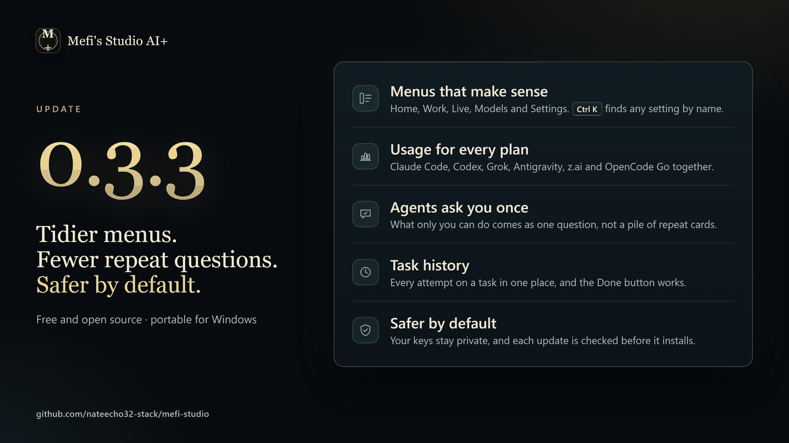
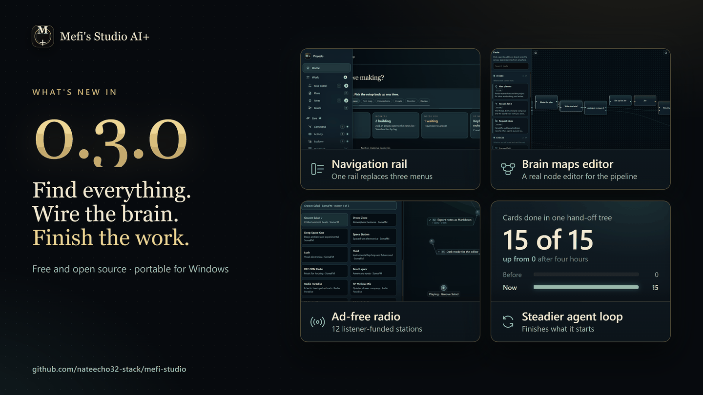
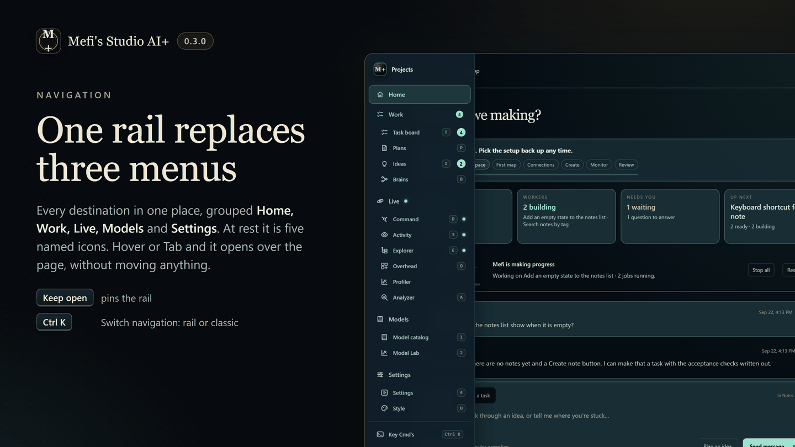
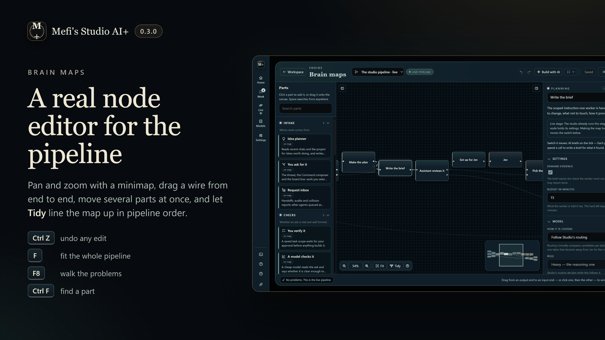
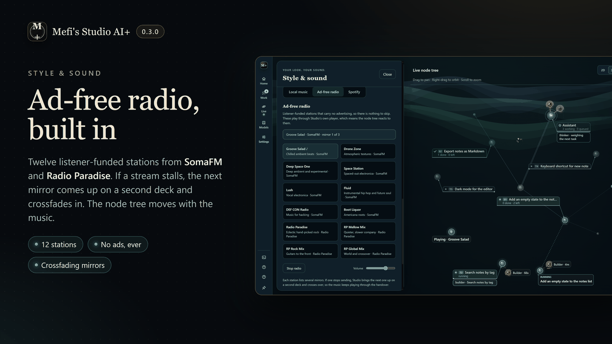
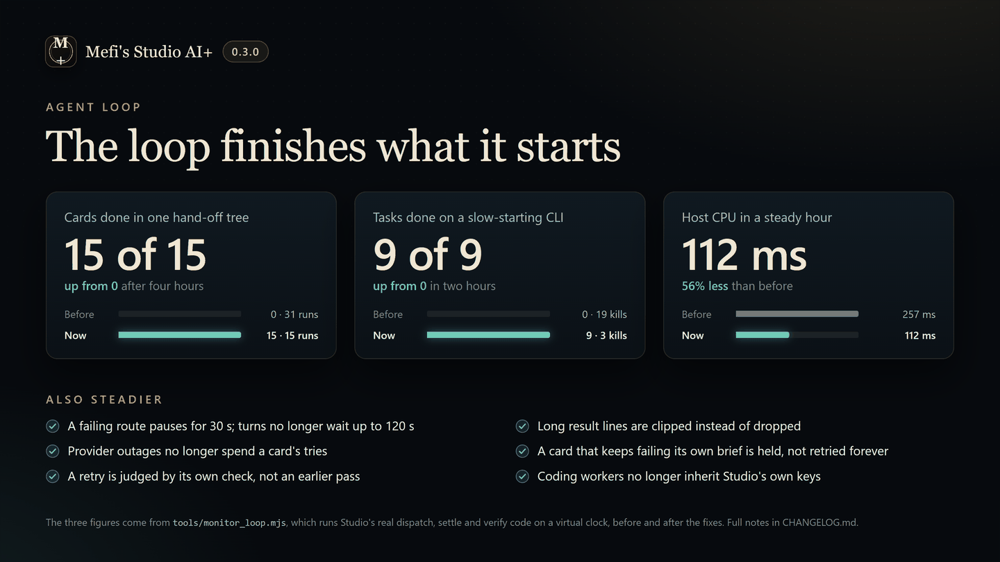

<p align="center">
  
</p>

<h1 align="center">Mefi's Studio AI+</h1>

<p align="center">
  <strong>A local-first desktop workspace where you talk an idea through with an AI companion, hand it over as a task, watch coding agents build it, and verify the result.</strong>
</p>

<p align="center">
  <a href="https://github.com/nateecho32-stack/mefi-studio/actions/workflows/ci.yml"></a>
  
  
  <a href="LICENSE"></a>
  
</p>

<p align="center">
  
</p>

**Quick links:** [What's new](#whats-new-in-040) · [Install](#install-and-run) · [First launch](#first-launch) · [Tour](#a-short-tour) · [Keys and privacy](#keys-and-privacy) · [Community](#community--perks) · [Docs](#documentation) · [Contributing](#contributing)

## What's new in 0.4.0

The Agent Brain: every task gets a pipeline you can watch (**Agent brain**,
`J`), sub-agents report up to their lead, a desk worker answers stuck
workers, a Playbook keeps the recipes that verified, and a project map built
from git history shows the project's systems on Home. A companion greets you
with what happened while you were away and keeps one list of everything that
needs you. The interface is glass over the live node tree, with a Links
player for music and video, and board and assistant updates now reach the
window once instead of once per panel. Get the portable build from the
[0.4.0 release](https://github.com/nateecho32-stack/mefi-studio/releases/tag/v0.4.0);
installed copies are offered it under **App updates**. The full list is in
the [changelog](CHANGELOG.md).

## What's new in 0.3.3

Tidier menus, fewer repeat questions from the agents, a Usage popover for
every plan, task run history, and safer defaults. Get the portable build from
the [0.3.3 release](https://github.com/nateecho32-stack/mefi-studio/releases/tag/v0.3.3);
installed copies are offered it under **App updates**. The full list is in
the [changelog](CHANGELOG.md).

<p align="center">
  
</p>

## What's new in 0.3.0

One navigation rail, Brain maps as a real node editor, ad-free radio, and an
agent loop that finishes what it starts. Get the portable build from the
[0.3.0 release](https://github.com/nateecho32-stack/mefi-studio/releases/tag/v0.3.0);
installed copies are offered it under **App updates**. The full list is in the
[changelog](CHANGELOG.md).

<p align="center">
  
</p>

<p align="center">
  
  
</p>
<p align="center">
  
  
</p>

## What it does

- **One folder at a time.** Pick a project folder and Studio scans it locally. Tasks, conversations, plans and references stay with that project.
- **Chat or create work.** Use *Chat* to think an idea through, or *Create task* to put work on the board with acceptance checks.
- **Agents do the work, visibly.** Coding workers (OpenCode, Claude Code, Codex, Grok or Antigravity CLIs) build tasks while an always-on service loop organises, audits and briefs. The **Command view** shows every session, task and agent as a live node tree.
- **"Done" means verified.** A finished attempt waits in *Review* with its evidence until checks pass or you confirm it.
- **Everything stays on your machine.** Keys are encrypted with the OS keystore, there is no telemetry and no hosted account. Linking a Discord account for the [community perks](#community--perks) is optional and talks only to discord.com.

## Requirements

| | Needed for | Notes |
| --- | --- | --- |
| **Windows 10/11** | Everything | Keys are protected by the Windows keystore (DPAPI). Other platforms are untested. |
| **Node 24 + npm** | Running from source | `npm ci` downloads Electron once (about 110 MB). The portable build needs neither. |
| **Git** | Cloning | |
| **Python 3** | `npm test` only | Must be on PATH as `python`. |
| **A builder CLI** (optional) | Building tasks | `opencode` is preferred; `claude`, `codex`, `grok` and `agy` are detected. Without one Studio still plans, chats and browses the catalog, but no build can start. |
| **An API key or local model** (optional) | The companion | z.ai, OpenCode Go or Zen, OpenRouter, a CLI login, LM Studio or any OpenAI-compatible endpoint. |

## Install and run

```powershell
git clone https://github.com/nateecho32-stack/mefi-studio.git
cd mefi-studio
npm ci                   # once; downloads Electron
npm run build-booklet    # bundles renderer/ into the committed renderer/booklet.html
npm start
```

- `npm start` needs a normal shell. If `ELECTRON_RUN_AS_NODE` is set (some agent harnesses set it), Studio refuses to start and prints the fix.
- `Run Mefi's Studio AI+.cmd` starts the portable build when one exists in `dist/`, otherwise the source install.
- **Portable build:** download a release, extract the whole folder, then open `Mefi Studio AI+.exe`. It keeps its own data next to the executable.
- `npm run start:web` serves a browser-only preview on <http://localhost:4173>; it cannot launch workers.

## First launch

1. **Choose a project** on the launch screen, then **Open studio** (agents stay off) or **Open and start agents**. Nothing runs before you choose. If a crash or a restart interrupted work in the last ten minutes, Studio skips the question, reopens that folder and restarts the agents that were running; closing the studio yourself always brings the question back.
2. **Follow the walkthrough.** *Start here* opens on the first launch with seven short stops: scan, workspace, first map, connections, create, monitor, review. Each stop's **Walk with me** opens the real menu and highlights the control. It remembers your place.
3. **Check the connection.** A fresh install runs **auto setup** by itself on the first launch, from the keys, CLIs and local servers already on the machine, and **Settings › Connections** says what it chose. Press **Run auto setup** again after adding a key or CLI, or configure a provider there. No key yet? The catalog, manual planning and saved work all work without one.
4. **Give one clear task** and watch it move from *Ready* to *Working* to *Review*.

[GETTING_STARTED.md](GETTING_STARTED.md) covers the same path in detail, including what every task state means and what to do next.

## A short tour

The **menu** down the left edge opens **Home**, **Work** and **Agents**, with section-local Back/Forward navigation. Agents contains Overview, Setup, Live, Workflows, Models and Usage. It stays open by default in wide windows; **Keep menu open** saves your preference. **Settings**, **Search** (`Ctrl K`) and **Help** stay at its foot. Help contains Start here, Shortcuts (`?`) and Community. The project selector at the top switches projects, and `Ctrl ,` opens Settings from anywhere.

### Your workspace (`H`)

The home screen. **Studio at a glance** shows the service state with a single Pause / Resume, running workers, what needs you, what is up next, the machine gauge and today's usage. Below it: the conversation with **Chat** and **Create task**, and **Your work** (Queue, Ideas, Review, Done). Expand **Queue settings** to change Auto build or Agent mode.

### Command view (`D`)

<p align="center">
  
</p>

Every session, task and agent is a node. Agents orbit the assistant, fly to the task they work on, and say what they are doing in speech bubbles. The panel on the right holds **Work**, **Assistant**, **Runs** (recent builds grouped by task) and **Ask**, where agents wait for your decision with a recommended option. **Agents** in the top toolbar opens queue settings and links to full team setup.

### Start here walkthrough

<p align="center">
  
</p>

### Settings (`4` or `Ctrl ,`)

<p align="center">
  
</p>

Settings keeps **General**, **Appearance**, **Audio** and **System**. Connections, model routing, team roles and workflow behavior now live in **Agents › Setup**. **Find a setting** searches individual controls and opens the matching category and disclosure. Connection forms and advanced options expand in place. Appearance includes Focus, Studio and Atmosphere presets and the live canvas preview. Agents and the companion share confirmed operational controls.

The main menu groups the app into **Home**, **Work** and **Agents**. See [Unified Studio](docs/unified-studio.md) for team presets, configuration scope, scrollbar-free navigation and the adaptive companion.
A local navigation row exposes each group's tools, while **Settings**, **Search**
and **Help** stay available. See the [interface inventory](docs/interface-remaster.md)
for the full set of screens and interior menus.

### Also in the box

**Tasks** (`T`) with briefs, prerequisites, attempts and evidence · **Plans** (`P`) that turn an unclear idea into a specification and tasks · **Ideas** (`I`) inbox · **Model catalog** (`1`) and **Performance** (`2`), plus Usage and Context · **Activity & evidence** (`3`), a read-only view of the coding sessions · **Sessions** (`E`), **Analyzer** (`A`), **Overhead** (`O`), **Appearance** (`U`), and the **Performance profiler** · **Search Studio** (`Ctrl K`) finds any page, tool, task, setting or model · `?` lists every shortcut.

The full feature walkthrough, in Studio's own vocabulary with a glossary, is in [docs/architecture.md](docs/architecture.md).

## Keys and privacy

- Keys are entered once in Settings › Connections and stored encrypted in the OS keystore; only "saved / not saved" reaches the UI. Headless setup: `MEFI_STUDIO_KEY=... electron . --set-key` and friends (see [.env.example](.env.example)).
- Git tracks only `data/curated.json` and `data/models.json`. Tasks, conversations, settings, databases and captures stay local and are never packaged.
- Agents run real commands in the project folder you chose. Turn **Auto build** off (*Verify first*) to approve each task before it runs.
- Nothing contacts Discord unless you link an account (below). The link reads your Discord id, username and roles in the Void Engine server, and nothing about your projects.
- See [SECURITY.md](SECURITY.md) for reporting.

## Community & perks

The **Void Engine Discord** (<https://discord.gg/xgfKc5pVxG>) is where people share what they build with Studio, swap model setups and hang out. Joining is free and optional. **Community** at the foot of the menu opens Settings › Community, which holds the link, your perks and a preview of the Void collection.

- **The Void collection.** Try four extra themes (**Void**, **Eclipse**, **Abyss**, **Neon Dusk**) and three node styles (**Singularity**, **Prism**, **Sigil**) in **Settings › Appearance**. Without a linked Discord membership, a choice is only a preview and resets when you close the canvas preview or leave Settings. Link a member account to keep it; a linked account outside the server can still preview but cannot save. The seven original themes, custom colours and the five original node styles stay free.
- **Linking.** Settings › Community › **Link my Discord** signs you in with Discord in your browser (OAuth2 with PKCE, redirected back to `127.0.0.1`, no client secret). Studio reads your Discord id, username and roles in the Void Engine server when you link, then about once a week. If Discord can't be reached, the perks stay on for 14 days after the last good check. Leaving the server locks them again at the next check.
- **The weekly card.** Non-members see a small invitation no sooner than three days after the first launch, then at most weekly, and monthly after four ignored showings. **Not now** snoozes it for a week and **Don't show again** stops it.
- **Unlinking.** Settings › Community › **Unlink** revokes Studio's grant at Discord and deletes the stored sign-in. You can also remove "Mefi Studio Link" under Discord › User Settings › Authorized Apps.
- **Or fork it.** Studio is MIT-licensed and the lock is honest. In your fork, set `SELF_UNLOCKED = true` in `scripts/community.cjs` and everything unlocks without Discord. Every locked item has a **Copy agent prompt** button that asks your coding agent to make that change.

A build whose Discord application id is not set yet offers only **Join** and the fork path. [docs/community.md](docs/community.md) covers the whole flow, what is stored where, and the maintainer's setup.

## Tests and checks

```powershell
npm run test:fast        # Node suites without the Electron fixtures (about 20 s)
npm run check            # targets, spec collisions, CSS merge + unused, syntax, TESTRUNS
npm run lint             # eslint, check-only
npm test                 # the gate: Node suites + Electron fixtures + Python contracts
npm run audit            # renderer/template contract audit
```

`npm test` needs Python 3 on PATH and a real desktop: nine suites drive Electron windows and are timing-sensitive. [CONTRIBUTING.md](CONTRIBUTING.md) explains the gates and conventions; [TESTRUNS.md](TESTRUNS.md) is the maintainers' lab notebook of past runs and flake triage, not a guide.

## Documentation

| Read this | For |
| --- | --- |
| [GETTING_STARTED.md](GETTING_STARTED.md) | First launch, new-machine checklist, your first task, what each state means |
| [docs/architecture.md](docs/architecture.md) | Glossary and the detailed feature walkthrough |
| [docs/code-map.md](docs/code-map.md) | Which file does what, folder by folder, and where to look first |
| [docs/agent-loop.md](docs/agent-loop.md) | How a chat message becomes a verified task, with file references |
| [docs/performance.md](docs/performance.md) | Measurements and how to reproduce them |
| [docs/community.md](docs/community.md) | The Void Engine Discord link: the weekly card, the login, what is stored, unlinking and the fork switch |
| [docs/ux-audit.md](docs/ux-audit.md) | The UX audit and its phased plan |
| [docs/pi-provider-storage.md](docs/pi-provider-storage.md) | How pi's coding agent stores provider config, and the settings/auth split Studio adopted from it |
| [CONTRIBUTING.md](CONTRIBUTING.md) | Check gates, test-file rules, parallel-session etiquette |
| [SECURITY.md](SECURITY.md) · [CHANGELOG.md](CHANGELOG.md) | Reporting and what changed |
| [docs/archive/](docs/archive/) | Historical audits and handoffs, kept for the reasoning |

## Optional: Ruins Runner

Studio can launch the author's LÖVE game from Settings › Integrations when a checkout is found (`MEFI_STUDIO_GAME_ROOT`, or a sibling `2d-Trippy-Hell` or `2d Trippy Hell` folder). A fresh clone works without it.

## Contributing

Issues and pull requests are welcome. Start with [CONTRIBUTING.md](CONTRIBUTING.md); the pull-request template lists the three gates. Bug reports are most useful with the version, the install kind, the selected route and builder, and the task state you saw.

## Discord Server Styler

Settings › Discord Server Styler starts the separate Server Styler project and opens its local
dashboard. **Start Server Styler** installs dependencies and builds the web app
when needed, then runs the dashboard and bot. **Stop** ends a process started by
Mefi. The status line reports when the bot is online or still needs setup.

Keep Server Styler in a sibling `discord-server-styler/` checkout. Set
`MEFI_STYLER_ROOT` to its absolute path if it lives elsewhere. Studio can still
find the former `Discord Bot/` directory under the optional game checkout.
Bot credentials stay in Server Styler's ignored `.env`, outside this repository.
Create that file from `.env.example`, set `DASHBOARD_PASSWORD`, then use the
dashboard's Discord sign-in and setup wizard to connect the bot to a server.
Rebuild the portable desktop app with `npm run package` after Studio source
changes.

## License

[MIT](LICENSE) © 2026 MefiMaxi
