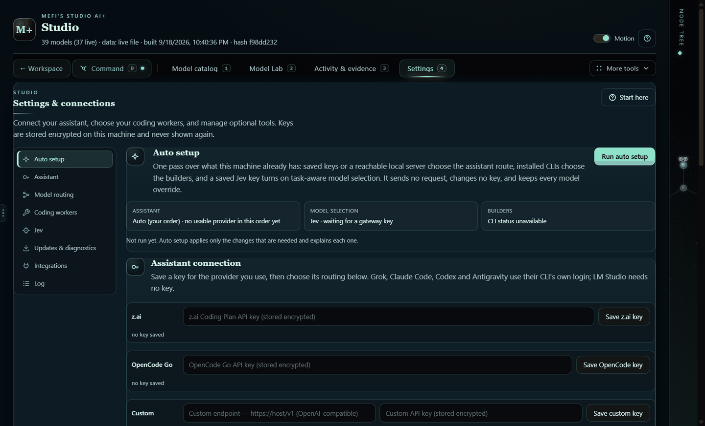
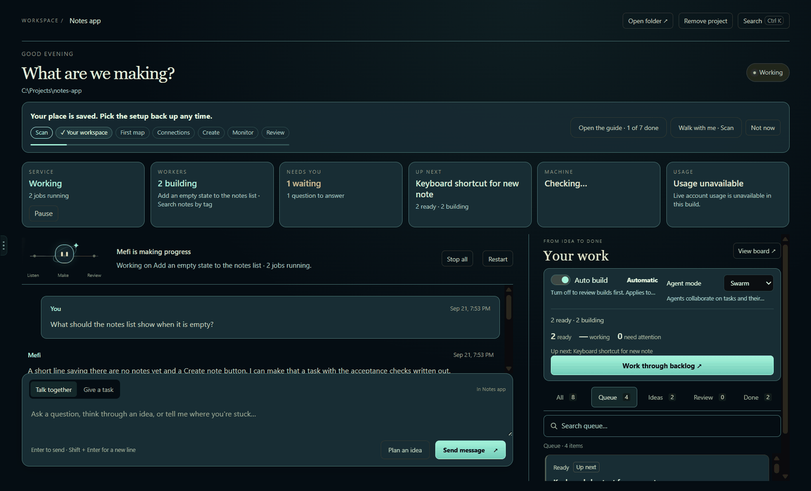
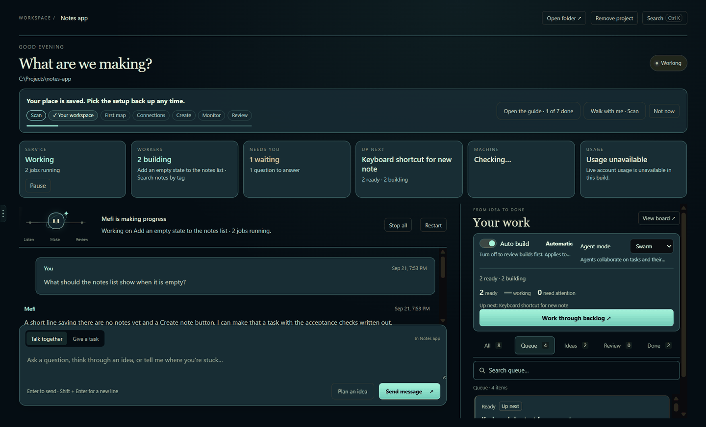
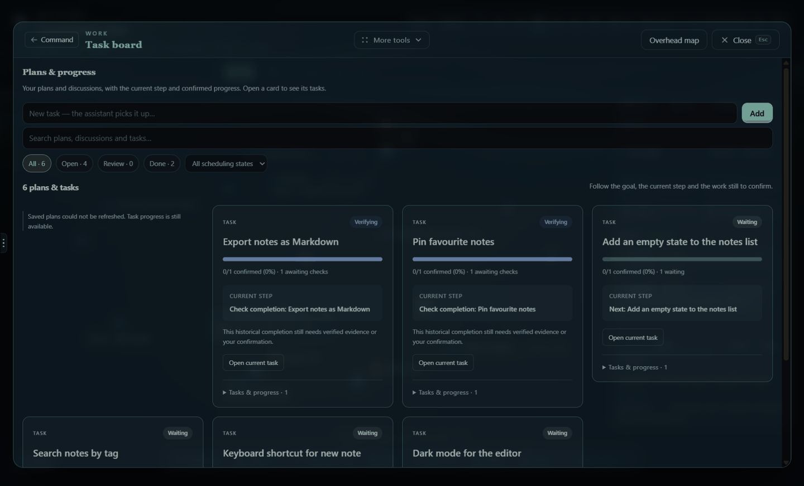

<p align="center">
  
</p>

<h1 align="center">Mefi's Studio AI+</h1>

<p align="center">
  <strong>A local-first desktop workspace where you talk an idea through with an AI companion, hand it over as a task, watch coding agents build it, and verify the result.</strong>
</p>

<p align="center">
  <a href="https://github.com/nateecho32-stack/mefi-studio/actions/workflows/ci.yml"></a>
  
  
  <a href="LICENSE"></a>
  
</p>

<p align="center">
  
</p>

**Quick links:** [Install](#install-and-run) · [First launch](#first-launch) · [Tour](#a-short-tour) · [Keys and privacy](#keys-and-privacy) · [Docs](#documentation) · [Contributing](#contributing)

## What it does

- **One folder at a time.** Pick a project folder and Studio scans it locally. Tasks, conversations, plans and references stay with that project.
- **Talk, then hand over.** *Talk together* to think an idea through, or *Give a task* to put real work on the board with acceptance checks.
- **Agents do the work, visibly.** Coding workers (OpenCode, Claude Code, Codex, Grok or Antigravity CLIs) build tasks while an always-on service loop organises, audits and briefs. The **Command view** shows every session, task and agent as a live node tree.
- **"Done" means verified.** A finished attempt waits in *Review* with its evidence until checks pass or you confirm it.
- **Everything stays on your machine.** Keys are encrypted with the OS keystore, there is no telemetry and no hosted account.

## Requirements

| | Needed for | Notes |
| --- | --- | --- |
| **Windows 10/11** | Everything | Keys are protected by the Windows keystore (DPAPI). Other platforms are untested. |
| **Node 24 + npm** | Running from source | `npm ci` downloads Electron once (about 110 MB). The portable build needs neither. |
| **Git** | Cloning | |
| **Python 3** | `npm test` only | Must be on PATH as `python`. |
| **A builder CLI** (optional) | Building tasks | `opencode` is preferred; `claude`, `codex`, `grok` and `agy` are detected. Without one Studio still plans, chats and browses the catalog, but no build can start. |
| **An API key or local model** (optional) | The companion | z.ai, OpenCode Go, a CLI login, LM Studio or any OpenAI-compatible endpoint. |

## Install and run

```powershell
git clone https://github.com/nateecho32-stack/mefi-studio.git
cd mefi-studio
npm ci                   # once; downloads Electron
npm run build-booklet    # bundles renderer/ into the committed renderer/booklet.html
npm start
```

- `npm start` needs a normal shell. If `ELECTRON_RUN_AS_NODE` is set (some agent harnesses set it), Studio refuses to start and prints the fix.
- `Run Mefi's Studio AI+.cmd` starts the portable build when one exists in `dist/`, otherwise the source install.
- **Portable build:** download a release, extract the whole folder, then open `Mefi Studio AI+.exe`. It keeps its own data next to the executable.
- `npm run start:web` serves a browser-only preview on <http://localhost:4173>; it cannot launch workers.

## First launch

1. **Choose a project** on the launch screen, then **Open studio** (agents stay off) or **Open and start agents**. Nothing runs before you choose.
2. **Follow the walkthrough.** *Start here* opens on the first launch with seven short stops: scan, workspace, first map, connections, create, monitor, review. Each stop's **Walk with me** opens the real menu and highlights the control. It remembers your place.
3. **Check the connection.** A fresh install runs **auto setup** by itself on the first launch, from the keys, CLIs and local servers already on the machine, and **Settings & connections** says what it chose. Press **Run auto setup** again after adding a key or CLI, or pick a route yourself. No key yet? The catalog, manual planning and saved work all work without one.
4. **Give one clear task** and watch it move from *Ready* to *Working* to *Review*.

[GETTING_STARTED.md](GETTING_STARTED.md) covers the same path in detail, including what every task state means and what to do next.

## A short tour

### Your workspace (`H`)

The home screen. **Studio at a glance** shows the service state with a single Pause / Resume, running workers, what needs you, what is up next, the machine gauge and today's usage. Below it: the conversation with your companion and **Your work** (Queue, Ideas, Review, Done).

### Command view (`D`)

<p align="center">
  
</p>

Every session, task and agent is a node. Agents orbit the assistant, fly to the task they work on, and say what they are doing in speech bubbles. The right rail holds **Work**, **Agents** (Autopilot, parallel builds, build mode, Swarm / Cluster), **Assistant**, **Done** and **Ask**, where agents wait for your decision with a recommended option.

### Start here walkthrough

<p align="center">
  
</p>

### Settings & connections (`4`)

<p align="center">
  
</p>

### Also in the box

**Task board** (`T`) with briefs, prerequisites, attempts and evidence · **Plans** (`P`) that turn an unclear idea into a specification and tasks · **Ideas** (`I`) inbox · **Model catalog** (`1`) and **Model Lab** (`2`) with measured latency, cost and usage · **Activity & evidence** (`3`), a read-only view of the coding sessions · **Session explorer** (`E`), **Analyzer** (`A`), **Overhead** (`O`), **Music & themes** (`U`) · `Ctrl K` finds any tool, task or setting · `?` lists every shortcut.

The full feature walkthrough, in Studio's own vocabulary with a glossary, is in [docs/architecture.md](docs/architecture.md).

## Keys and privacy

- Keys are entered once in Settings and stored encrypted in the OS keystore; only "saved / not saved" reaches the UI. Headless setup: `MEFI_STUDIO_KEY=... electron . --set-key` and friends (see [.env.example](.env.example)).
- Git tracks only `data/curated.json` and `data/models.json`. Tasks, conversations, settings, databases and captures stay local and are never packaged.
- Agents run real commands in the project folder you chose. Turn **Auto build** off (*Verify first*) to approve each task before it runs.
- See [SECURITY.md](SECURITY.md) for reporting.

## Tests and checks

```powershell
npm run check            # targets, spec collisions, CSS cascade gates, syntax
npm test                 # Node behavioural tests + Python contracts
npm run audit            # renderer/template contract audit
```

`npm test` needs Python 3 on PATH and a real desktop: two fixtures drive Electron windows and are timing-sensitive. [CONTRIBUTING.md](CONTRIBUTING.md) explains the gates and conventions; [TESTRUNS.md](TESTRUNS.md) is the maintainers' lab notebook of past runs and flake triage, not a guide.

## Documentation

| Read this | For |
| --- | --- |
| [GETTING_STARTED.md](GETTING_STARTED.md) | First launch, new-machine checklist, your first task, what each state means |
| [docs/architecture.md](docs/architecture.md) | Glossary and the detailed feature walkthrough |
| [docs/agent-loop.md](docs/agent-loop.md) | How a chat message becomes a verified task, with file references |
| [docs/performance.md](docs/performance.md) | Measurements and how to reproduce them |
| [docs/ux-audit.md](docs/ux-audit.md) | The UX audit and its phased plan |
| [CONTRIBUTING.md](CONTRIBUTING.md) | Check gates, test-file rules, parallel-session etiquette |
| [SECURITY.md](SECURITY.md) · [CHANGELOG.md](CHANGELOG.md) | Reporting and what changed |
| [docs/archive/](docs/archive/) | Historical audits and handoffs, kept for the reasoning |

## Optional: Ruins Runner

Studio can launch the author's LÖVE game from Settings › Integrations when a checkout is found (`MEFI_STUDIO_GAME_ROOT`, or a sibling `2d Trippy Hell` folder). A fresh clone works without it.

## Contributing

Issues and pull requests are welcome. Start with [CONTRIBUTING.md](CONTRIBUTING.md); the pull-request template lists the three gates. Bug reports are most useful with the version, the install kind, the selected route and builder, and the task state you saw.

## License

[MIT](LICENSE) © 2026 MefiMaxi
