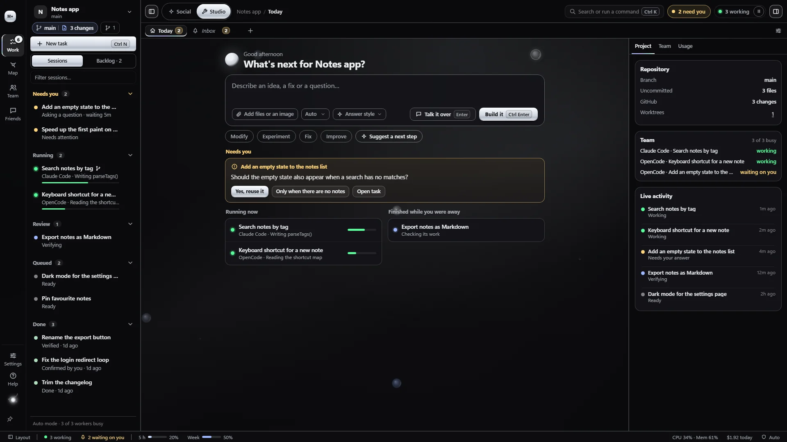
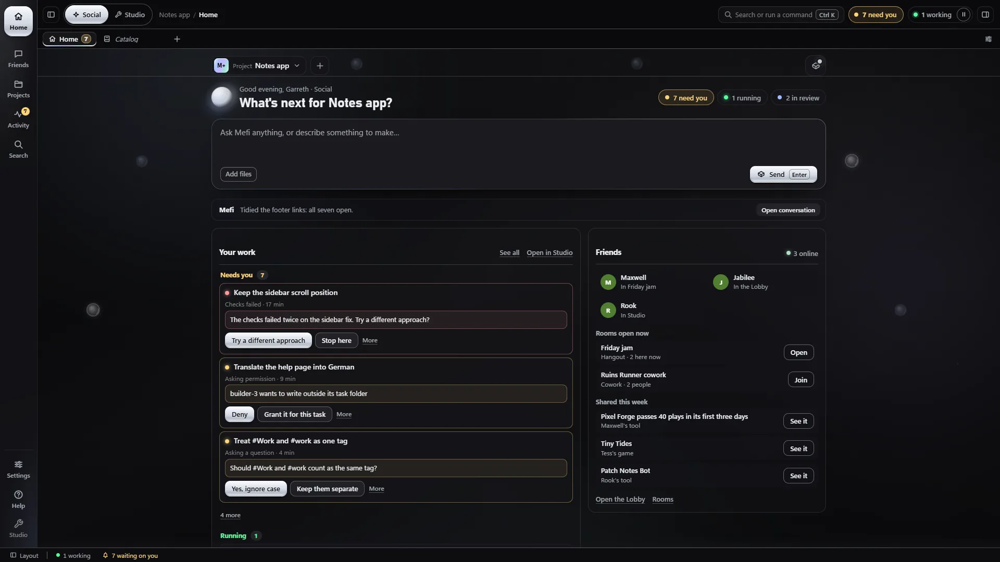
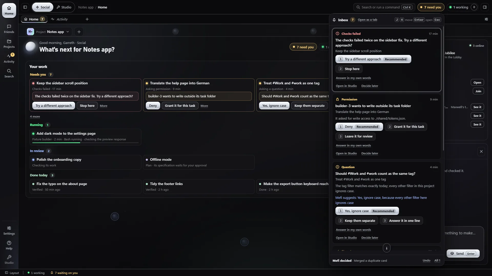
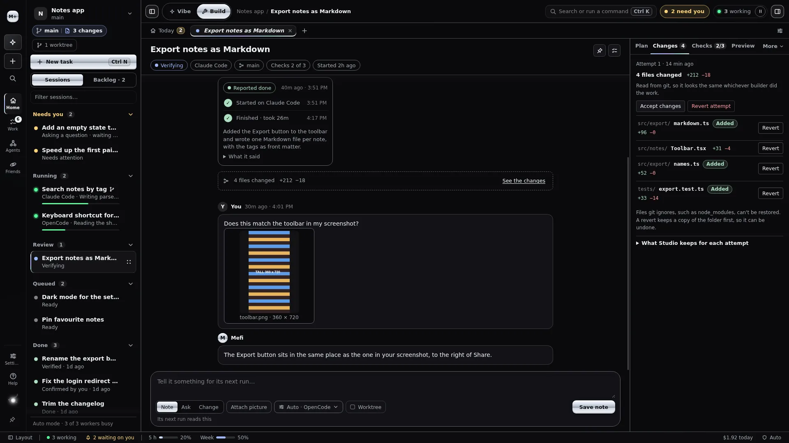
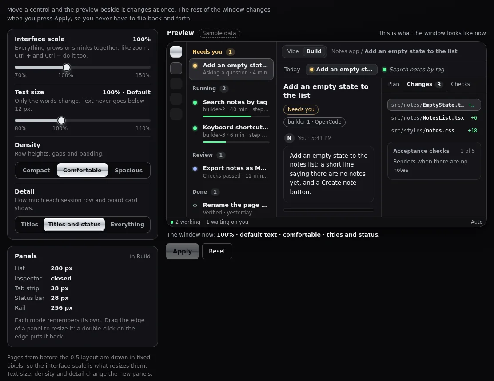
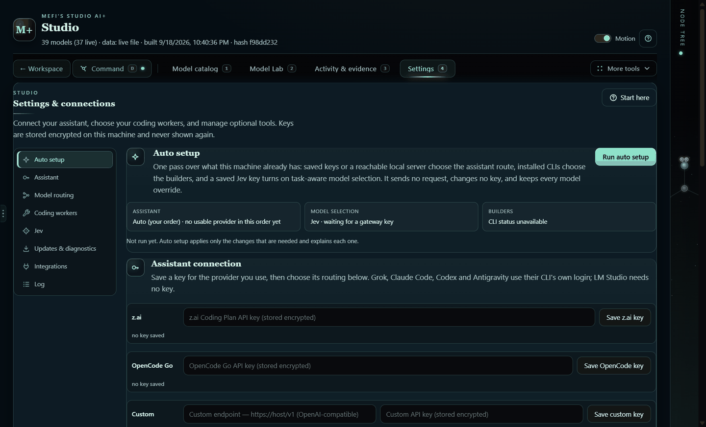
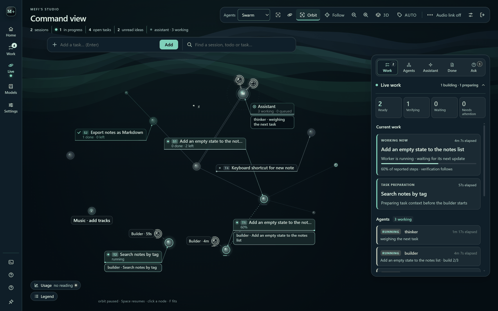
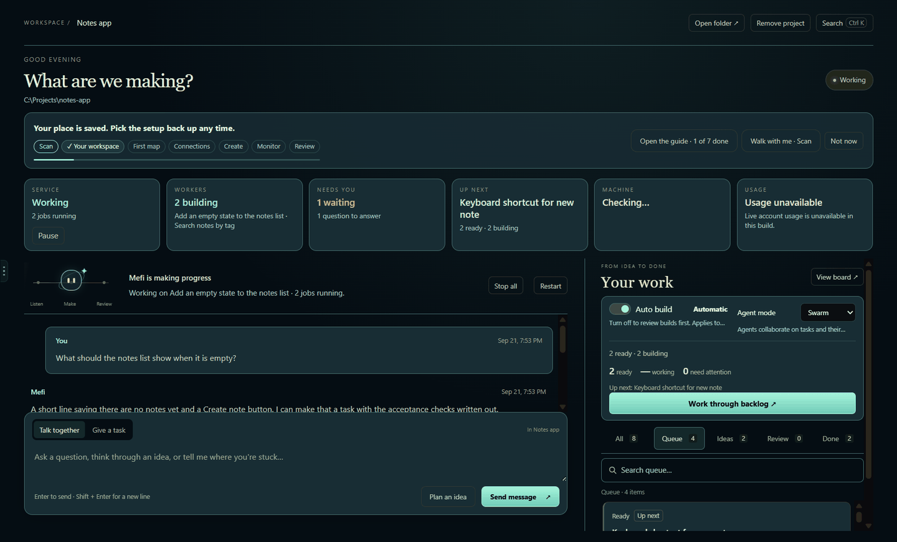
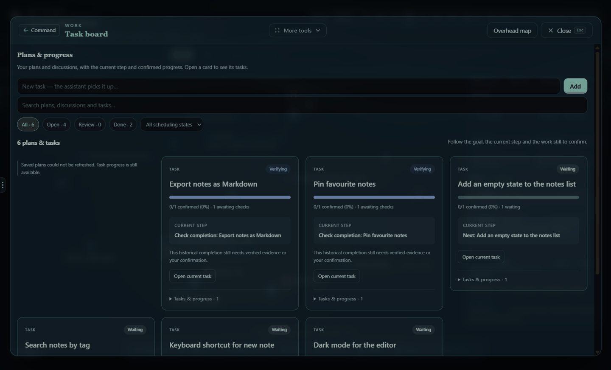

<p align="center">
  
</p>

<h1 align="center">Mefi Studio</h1>

<p align="center">
  <strong>Bring an idea. Find your people. Make it together.</strong><br>
  A free, open-source Windows app for building your ideas with coding agents, in good company.
</p>

<p align="center">
  <a href="https://github.com/nateecho32-stack/mefi-studio/releases/tag/v0.4.4"></a>
  <a href="https://nateecho32-stack.github.io/mefi-studio/roadmap.html#now"></a>
  <a href="docs/rust-migration.md"></a>
  <a href="https://github.com/nateecho32-stack/mefi-studio/actions/workflows/ci.yml"></a>
  <br>
  
  
  <a href="LICENSE"></a>
  
</p>

<p align="center">
  <a href="https://github.com/nateecho32-stack/mefi-studio/releases/tag/v0.4.4"><strong>Download 0.4.4</strong></a> ·
  <a href="https://nateecho32-stack.github.io/mefi-studio/">Website</a> ·
  <a href="https://nateecho32-stack.github.io/mefi-studio/roadmap.html">Roadmap</a> ·
  <a href="https://nateecho32-stack.github.io/mefi-studio/wiki/">Guide</a> ·
  <a href="https://discord.gg/xgfKc5pVxG">Discord</a>
</p>

<p align="center">
  
  <br>
  <sub>The 0.5 layout in Studio mode, in the new Chrome theme, from the current build on <code>main</code> with sample data.</sub>
</p>

Pick a project folder, say what you want, and coding agents build it while you watch. Every change waits for you to accept or revert it, and the [Void Engine Discord](https://discord.gg/xgfKc5pVxG) is there when you want company, feedback or a hand.

## Where Studio is now

| | |
| --- | --- |
| **Download** | **0.4.4**, released 27 September 2026. [Release notes](docs/releases/0.4.4.md) |
| **Next** | **0.5 is being built** on `main`, with no release date yet. What was planned for 0.4.5 and 0.4.6 is folded into it. 0.4.4 cannot install 0.5 by itself, so that one update is by hand; the steps come with the release. [What's in 0.5](docs/release-scope-0.5.0.md) |
| **Platform** | **Studio is moving from Electron to Rust** with Tauri 2, in three stages. The interface, your settings and your saved keys stay the same, and the Electron build keeps shipping until the switch. [How it works](docs/rust-migration.md) |

The [public roadmap](https://nateecho32-stack.github.io/mefi-studio/roadmap.html) lists what is done, what is being worked on and what is planned. The [changelog](CHANGELOG.md) lists every change since 0.4.4 under Unreleased.

## What it does

- **One folder at a time.** Pick a project folder and Studio scans it locally. Tasks, conversations, plans and references stay with that project.
- **Chat or create work.** Talk an idea through, or put work on the board with acceptance checks. Big requests become a short plan of steps.
- **Agents do the work, visibly.** Coding workers (OpenCode, Claude Code, Codex, Grok or Antigravity CLIs) build tasks while an always-on service loop organises, audits and briefs. You see every run, step and question as it happens.
- **"Done" means verified.** A finished attempt waits in *Review* with its evidence until checks pass or you confirm it.
- **Your call, every time.** Permission modes from *Always ask* to *Auto*, questions that wait in one place, and an *Undo* for automatic choices.
- **Works with the tools you already use.** Claude Code, Codex, Cursor or a script on the same PC can check on Studio, message Mefi and hand it tasks (they wait for your OK), through an MCP server and a local API that are off until you turn them on. **Copy setup prompt** hands those helpers everything they need to walk you through setup.
- **Local storage, your choice of AI.** Project records and settings stay on your machine, keys are encrypted with the OS keystore, and Studio has no usage telemetry or required hosted account. Connected AI providers and coding tools may receive prompts and project context.

## Coming in 0.5

0.5 puts two modes in one frame: **Social** (once called Vibe), for vibing with friends and keeping a light eye on agents, and **Studio** (once called Build), for in-depth building. Your sessions on the left, the work in the middle, an inspector beside it, tabs on top and a status bar below; Ctrl+M switches modes. It is the only layout on `main`: a source run opens in it. The 0.4.4 download keeps the classic layout described further down until 0.5 is released.

<table>
  <tr>
    <td width="50%" valign="top">
      
      <p><strong>Home.</strong> Social's home: one box to talk with Mefi, your work in short, and who is online.</p>
    </td>
    <td width="50%" valign="top">
      
      <p><strong>One Inbox.</strong> Every question, approval and failed check that waits on you, with a suggested answer.</p>
    </td>
  </tr>
  <tr>
    <td width="50%" valign="top">
      
      <p><strong>Changes you can take back.</strong> See the files a worker changed, then accept them or revert one file or the whole attempt.</p>
    </td>
    <td width="50%" valign="top">
      
      <p><strong>Size and density.</strong> Interface scale, text size, density and detail, with a live miniature before you apply.</p>
    </td>
  </tr>
</table>

Also in 0.5: an easier first run (**Start a new app** on the launch screen, **Pick the AI that builds for you** in plain words, and **What should Studio make first?**), **Chrome**, a new matte black and brushed-metal theme with an iridescent finish (silver, ice blue, lilac and aqua on its edges and highlights) that new installs open in (a theme you already picked stays), tabs you add and pin, Work › Worktrees, Windows notifications and quiet hours, Report a problem, What's new after an update, pictures on a message, the `@ # /` picker, Skills and rules for agents, and The Studio Daily. The [0.5 scope](docs/release-scope-0.5.0.md) has the full list and what moves to 0.5.x.

## Moving to Rust

Started 3 October 2026. The UI stays HTML and JavaScript in WebView2; Rust takes the host and then the engine, one part at a time, and the app keeps working at every step.

| Stage | What it means | Status |
| --- | --- | --- |
| **1. The Rust host** | Rust runs the window, tray, dialogs, notifications, saved keys and the page's bridge, with today's engine beside it. | Built on `main`: `npm run host` runs it from source |
| **2. The engine moves into Rust** | Each part moves whole and must give the same answers as the JavaScript it replaces; parity tests run both. Nine parts so far: the session store, sync and worktrees, the file picker's search, the Git chip's actions and state, Skills, pictures, Revert, and settings and keys. The usage ledger's repeat reads are already about nine times faster. | In progress |
| **3. One Rust program** | A release carries only the Rust host, with no Node runtime beside it. One bridge release carries today's installs across. | Planned |

Settings, saved keys and projects stay where they are (`%APPDATA%\Mefi's Studio AI+`). Building the host needs Rust stable (MSVC) and the Visual Studio 2022 C++ build tools; [docs/rust-migration.md](docs/rust-migration.md) has the commands, the parity table and the rules.

## Get started

### Download (Windows)

1. Download the zip from the [latest release](https://github.com/nateecho32-stack/mefi-studio/releases/tag/v0.4.4).
2. Right-click it, choose **Extract All**, keep the folder together, and open `Mefi Studio AI+.exe`.
3. The build is not code-signed yet, so Windows SmartScreen may ask the first time: **More info**, then **Run anyway**.

The portable build keeps its tasks, ideas, plans and conversations in its own `resources\app\data` folder. Settings, saved keys, the project list, the Discord link and resume state live in `%APPDATA%\Mefi's Studio AI+`, shared with a source install on the same Windows account, so only one of the two runs at a time: opening the other brings the running one forward.

### Newest build from main (beta)

Every green push to `main` also makes a ready-to-run beta build, kept on GitHub for 14 days. No Node, Git or commands needed:

1. Sign in to GitHub, open [Actions › Studio checks](https://github.com/nateecho32-stack/mefi-studio/actions/workflows/ci.yml?query=branch%3Amain), pick the newest green run on `main` and download **mefi-studio-development-win32-x64** under Artifacts.
2. Unzip it, unzip the `Mefi-Studio-AI+-v…-win32-x64.zip` inside it, and open `Mefi Studio AI+.exe`.
3. To stay on the newest build, turn on **Settings › System › Updates › Development / beta**. Studio then installs each new build of `main` by itself while no work is running. It needs a GitHub sign-in on that PC; **Set up this PC** installs the GitHub CLI for it.

Beta builds have not been through a release's checks: back up your work first.

### Updating from 0.4.4

An installed 0.4.4 cannot update itself. Its update helper never runs, so the **Update** button downloads the new build, Studio quits and nothing is installed. 0.5 carries the fix, so in-app updates work from 0.5 onward. When 0.5 is out, move a portable 0.4.4 to it by hand:

1. Close Studio. Opening a second copy while it runs only brings the running one forward.
2. Download the Windows zip from the [releases page](https://github.com/nateecho32-stack/mefi-studio/releases) and extract it to a **new** folder.
3. Copy the old folder's `resources\app\data` into the new folder's `resources\app`. It holds your tasks, ideas, plans and conversations. The release brings its own `curated.json` and `models.json`; keep the new ones if Windows asks.
4. Open `Mefi Studio AI+.exe` from the new folder.

Settings, saved keys and the project list live in `%APPDATA%\Mefi's Studio AI+`, so they carry over on their own. Keep the old folder until you have seen your work in the new one.

### From source

```powershell
git clone https://github.com/nateecho32-stack/mefi-studio.git
cd mefi-studio
npm ci                   # once; downloads Electron
npm run build-booklet    # bundles renderer/ into the committed renderer/booklet.html
npm start
```

- `npm start` needs a normal shell. If `ELECTRON_RUN_AS_NODE` is set (some agent harnesses set it), Studio refuses to start and prints the fix.
- `Run Mefi's Studio AI+.cmd` starts the portable build when one exists in `dist/`, otherwise the source install.
- `npm run host` runs the same app on the Rust host instead (see [Moving to Rust](#moving-to-rust)).
- `npm run start:web` serves a browser-only preview on <http://localhost:4173>; it cannot launch workers.

| | Needed for | Notes |
| --- | --- | --- |
| **Windows 10/11** | Everything | Keys are protected by the Windows keystore (DPAPI). Other platforms are untested. |
| **Node 24 + npm** | Running from source | `npm ci` downloads Electron once (about 110 MB), and stops at once on an older Node. The portable build needs neither. |
| **Git** | Cloning; recommended at runtime | Studio reads the open project through git to verify a result that claims a commit, warn agents about staged or uncommitted work and add history to the project map; Friends › Your PCs and worktree runs need it. Without git those checks are skipped or read as unknown. |
| **Python 3** | `npm test` only | Found as `python`, `py -3` or `python3`; the `py` launcher that python.org's installer adds by default is enough. |
| **A builder CLI** (optional) | Building tasks | `opencode` is preferred; `claude`, `codex`, `grok` and `agy` are detected. Without one Studio still plans, chats and browses the catalog, but no build can start. |
| **An API key or local model** (optional) | The companion | z.ai, OpenCode Go or Zen, OpenRouter, a CLI login, LM Studio or any OpenAI-compatible endpoint. |

### First launch

1. **Choose a project** on the launch screen, then **Open** (agents stay off unless you turn the **Start agents** switch on). Nothing runs before you choose. If a crash or a restart interrupted work in the last ten minutes, Studio skips the question, reopens that folder and restarts the agents that were running; closing the studio yourself always brings the question back.
2. **Follow the walkthrough.** *Start here* opens on the first launch with seven short stops: scan, workspace, first map, connections, create, monitor, review. Each stop's **Walk with me** opens the real menu and highlights the control. It remembers your place.

   At Scan or First map, choose an existing Codex, Claude Code, Grok or Antigravity login, or **Install and sign in**. **Check connection**, then **Use for the whole studio** routes mapping, chat, planning, agents and coding through that account. Have an API key (z.ai, OpenCode Go or Zen, OpenRouter, a custom endpoint) or a local server (LM Studio, Ollama) instead? **I have an API key or a local model server** takes you to Connections and scans again when you return. OpenCode is optional. See [guided CLI setup](docs/cli-setup.md) for installation and account limits.
3. **Check the connection.** A fresh install runs **auto setup** by itself on the first launch, from the keys, CLIs and local servers already on the machine, and **Settings › Connections** says what it chose. Press **Run auto setup** again after adding a key or CLI, or configure a provider there. No key yet? The catalog, manual planning and saved work all work without one.
4. **Give one clear task** and watch it move from *Ready* to *Working* to *Review*.

[GETTING_STARTED.md](GETTING_STARTED.md) walks through 0.5 (on `main` and in the beta builds) step by step, in plain words: your first ten minutes, where things are, and what every task state means.

## A short tour of 0.4.4

<details>
<summary>The screens in the current download: Vibe or Build, the workspace, Command view, Start here and Settings.</summary>

### Vibe or Build

**Vibe** puts conversation, task creation, work in progress and decisions on one
screen. Its **Needs you** drawer handles questions, build approvals and blocked
tasks. Open other tools from its dock and return to Vibe from the top of the rail.
Switch to **Build** for the full workspace described below; Studio remembers
which mode you use during updates. New launches start in Vibe; turn off
**Always start in Vibe** in Settings to keep your last mode across launches.

The **menu** down the left edge opens **Home**, **Work**, **Agents** and **Friends**, with section-local Back/Forward navigation for pages. Friends opens the companion's existing Friends menu; its Rooms, Your PCs and Playground links go straight to the matching card. Agents contains Overview, Setup, Live, Workflows, Models and Usage. It stays open by default in wide windows; **Keep menu open** saves your preference. **Settings**, **Search** (`Ctrl K`) and **Help** stay at its foot. Help contains Start here, Shortcuts (`?`) and Community. The project selector at the top switches projects, and `Ctrl ,` opens Settings from anywhere.

### Your workspace (`H`)

<p align="center">
  
</p>

The home screen. **Studio at a glance** shows the service state with a single Pause / Resume, running workers, what needs you, what is up next, the machine gauge and today's usage. Below it: the conversation with **Chat** and **Create task**, and **Your work** (Queue, Ideas, Review, Done). Expand **Queue settings** to change Auto build or Agent mode.

### Command view (`D`)

<p align="center">
  
</p>

Every session, task and agent is a node. Agents orbit the assistant, fly to the task they work on, and say what they are doing in speech bubbles. The panel on the right holds **Work**, **Assistant**, **Runs** (recent builds grouped by task) and **Ask**, where agents wait for your decision with a recommended option. **Agents** in the top toolbar opens queue settings and links to full team setup.

### Start here walkthrough

<p align="center">
  
</p>

### Settings (`4` or `Ctrl ,`)

<p align="center">
  
</p>

Settings keeps **General**, **Appearance**, **Audio** and **System**. Connections, model routing, team roles and workflow behavior live in **Agents › Setup**. **Find a setting** searches individual controls and opens the matching category and disclosure. Connection forms and advanced options expand in place. Appearance includes Focus, Studio and Atmosphere presets and the live canvas preview. Agents and the companion share confirmed operational controls.

See [Unified Studio](docs/unified-studio.md) for team presets, configuration scope, scrollbar-free navigation and the adaptive companion, and the [interface inventory](docs/interface-remaster.md) for the full set of screens and interior menus.

### Also in the box

**Tasks** (`T`) with briefs, prerequisites, attempts and evidence · **Plans** (`P`) that turn an unclear idea into a specification and tasks · **Ideas** (`I`) inbox · **Model catalog** (`1`) and **Performance** (`2`), plus Usage and Context · **Activity & evidence** (`3`), a read-only view of the coding sessions · **Sessions** (`E`), **Analyzer** (`A`), **Overhead** (`O`), **Appearance** (`U`), and the **Performance profiler** · **Search Studio** (`Ctrl K`) finds any page, tool, task, setting or model · `?` lists every shortcut.

Watch the [40-second showreel](https://github.com/nateecho32-stack/mefi-studio/releases/download/v0.4.2/mefi-studio-v0.4.2-discord.mp4) (sample tasks from 0.4.2).

</details>

The full feature walkthrough, in Studio's own vocabulary with a glossary, is in [docs/architecture.md](docs/architecture.md).

## Keys and privacy

- Keys are entered once in Settings › Connections and stored encrypted in the OS keystore; only "saved / not saved" reaches the UI. Headless setup, from a source checkout in PowerShell: `$env:MEFI_STUDIO_KEY = "<key>"; npx electron . --set-key`, then `Remove-Item Env:MEFI_STUDIO_KEY` (while it is set it overrides the saved key). [.env.example](.env.example) pairs every `--set-*-key` flag with its variable.
- Git tracks only `data/curated.json` and `data/models.json`. Tasks, conversations, settings, databases and captures stay local and are never packaged.
- Agents run real commands in the project folder you chose. Turn **Auto build** off (*Verify first*) to approve each task before it runs.
- Nothing contacts Discord unless you link an account. The link reads your Discord id, username and roles in the Void Engine server, and nothing about your projects.
- See [SECURITY.md](SECURITY.md) for reporting.

<a id="community--perks"></a>

## Community

The [Void Engine Discord](https://discord.gg/xgfKc5pVxG) is where people share projects, ask for feedback and hang out while they build. Unfinished ideas are welcome. Come meet **Studio**, the Discord bot, and help shape what it becomes. Discord is optional: Studio works on its own, and ideas and bug reports are just as welcome on GitHub.

- **Rooms** (Friends › Rooms) lists your rooms and the listed ones you can join. Ask to join with a short note, accept or decline invites, and for rooms you own, let people in, invite by name, lock or close the room, and make new ones (hangout or cowork, open or invite-only, listed or not). Each room has a plain-text chat with @names; links are never clickable. Rooms need the room service's address in the build and a linked Discord account; until then the panel says what is missing.
- **Listen together** and companion playdates are built and switch on once the community's rooms hub is online. The personal media player is available now.
- **Every theme and node style Studio comes with is free**, the Void collection included. The Shop's extras, two node styles among them, cost credits you earn by making and playing things, never money.

The [community guide](https://nateecho32-stack.github.io/mefi-studio/wiki/#/community) explains what's available. [Public site and voice direction](docs/public-site.md) records the website's location, public naming and proposed voice integration.

## Working from several PCs

GitHub is the meeting point: each PC keeps its own clone, and the project's default branch on GitHub is the one shared state. **Friends › Your PCs** shows what has not reached GitHub yet and syncs only after the project's own check passes; **Share between my PCs** moves brains, recipes, team setups and preferences through a sealed private repository; **Share with friends** makes a reviewed `.mefishare` file. `npm run sync` and `npm run worktrees` do the same from a terminal. [docs/your-pcs.md](docs/your-pcs.md) has the details.

## Tests and checks

```powershell
npm run test:fast        # Node suites without the Electron fixtures (about 20 s)
npm run check            # targets, spec collisions, CSS merge + unused, syntax, TESTRUNS
npm run lint             # eslint, check-only
npm test                 # the gate: Node suites + Electron fixtures + Python contracts
npm run audit            # renderer/template contract audit
npm run host:test        # the Rust host's unit tests (needs Rust)
```

`npm test` needs Python 3 (`python`, `py -3` or `python3`) and a real desktop: the Electron suites drive real windows and are timing-sensitive. [CONTRIBUTING.md](CONTRIBUTING.md) explains the gates and conventions; [TESTRUNS.md](TESTRUNS.md) is the maintainers' lab notebook of past runs and flake triage, not a guide.

## Documentation

| Read this | For |
| --- | --- |
| [GETTING_STARTED.md](GETTING_STARTED.md) | First launch, new-machine checklist, your first task, what each state means |
| [docs/architecture.md](docs/architecture.md) | Glossary and the detailed feature walkthrough |
| [docs/code-map.md](docs/code-map.md) | Which file does what, folder by folder, and where to look first |
| [docs/release-scope-0.5.0.md](docs/release-scope-0.5.0.md) | What 0.5 includes and what moves to 0.5.x |
| [docs/rust-migration.md](docs/rust-migration.md) | The move to Rust: stages, the bridge, the parity table and the rules |
| [docs/unified-studio.md](docs/unified-studio.md) | The menu, team presets, configuration scope and the 0.5 frame |
| [docs/agent-loop.md](docs/agent-loop.md) | How a chat message becomes a verified task, with file references |
| [docs/performance.md](docs/performance.md) | Measurements and how to reproduce them |
| [docs/your-pcs.md](docs/your-pcs.md) | Your PCs, Share between my PCs and Share with friends |
| [docs/community.md](docs/community.md) | The Void Engine Discord link: the weekly card, the login, what is stored, unlinking and the fork switch |
| [docs/remote.md](docs/remote.md) | Reach your PCs from Discord: what a DM can and cannot do, the PIN, alerts, and the hub protocol |
| [docs/studio-api.md](docs/studio-api.md) | Other apps: the setup prompt for Claude Code or Codex, and the Studio API, MCP server and command line apps on this PC use to reach Studio |
| [docs/fleet-overhaul-plan.md](docs/fleet-overhaul-plan.md) | The fleet overhaul: seats, pods, missions and Refocus, Live › Fleet, and the phase plan |
| [docs/ux-audit.md](docs/ux-audit.md) · [docs/pi-provider-storage.md](docs/pi-provider-storage.md) | The UX audit and its phased plan · how pi's coding agent stores provider config |
| [CONTRIBUTING.md](CONTRIBUTING.md) | Check gates, test-file rules, parallel-session etiquette |
| [SECURITY.md](SECURITY.md) · [CHANGELOG.md](CHANGELOG.md) | Reporting and what changed |
| [docs/archive/](docs/archive/) | Historical audits and handoffs, kept for the reasoning |

## Optional integrations

<details>
<summary>Ruins Runner and the Discord Server Styler, two separate projects Studio can start.</summary>

### Ruins Runner

Studio can launch the author's LÖVE game from Settings › Integrations when a checkout is found (`MEFI_STUDIO_GAME_ROOT`, or a sibling `2d-Trippy-Hell` or `2d Trippy Hell` folder). A fresh clone works without it.

### Discord Server Styler

Settings › Discord Server Styler starts the separate Server Styler project and opens its local
dashboard. **Start Server Styler** installs dependencies and builds the web app
when needed, then runs the dashboard and bot. **Stop** ends a process started by
Mefi. The status line reports when the bot is online or still needs setup.

Keep Server Styler in a sibling `discord-server-styler/` checkout. Set
`MEFI_STYLER_ROOT` to its absolute path if it lives elsewhere. Studio can still
find the former `Discord Bot/` directory under the optional game checkout.
The card stays out of Settings until Studio finds one of these.
Bot credentials stay in Server Styler's ignored `.env`, outside this repository.
Create that file from `.env.example`, set `DASHBOARD_PASSWORD`, then use the
dashboard's Discord sign-in and setup wizard to connect the bot to a server.
Rebuild the portable desktop app with `npm run package` after Studio source
changes.

</details>

## Contributing

Issues and pull requests are welcome. Start with [CONTRIBUTING.md](CONTRIBUTING.md); the pull-request template lists the three gates. Bug reports are most useful with the version, the install kind, the selected route and builder, and the task state you saw. Feature requests go to [GitHub issues](https://github.com/nateecho32-stack/mefi-studio/issues) or the Discord.

## Code signing

Releases so far are unsigned, so Windows SmartScreen asks before the first
launch: **More info**, then **Run anyway**. Studio is moving to free code
signing from the SignPath Foundation. The policy, including what gets signed,
who approves it and what Studio sends over the network, is in
[docs/code-signing.md](docs/code-signing.md).

## License

[MIT](LICENSE) © 2026 MefiMaxi
