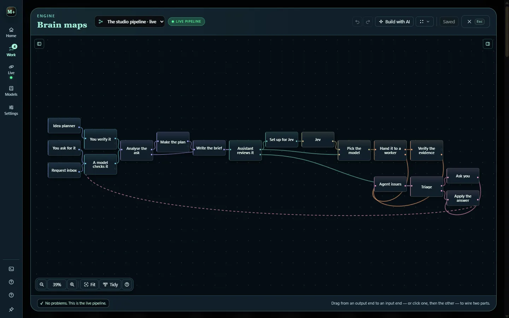
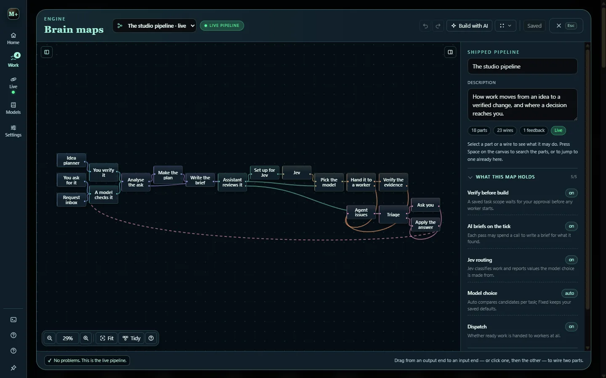

# Brain maps and the decision lane

The agent loop always had a pipeline: an idea or a request is checked, analysed, planned, briefed, reviewed, set up for Jev, routed to a model, built and verified. A **brain map** is that pipeline as data: typed parts, typed ports and wires between them, each part with its own permissions, model and settings. The repository's [brain-maps.md](https://github.com/nateecho32-stack/mefi-studio/blob/main/docs/brain-maps.md) is the full reference.

Open it with `B`, from **Work** in the rail, or from `Ctrl K`.



## The shipped map

The shipped map, **The studio pipeline**, is exactly the loop Studio already runs, drawn out: 18 parts and 23 wires, with the decision lane hanging off the build. It can be edited freely and reset from the inspector.

```text
idea planner ─┐                                    ┌─ Jev ─┐
you ask for it ┼→ checks → analyse → plan → write the brief
request inbox ─┘                     → assistant review → set up for Jev
                                                  ↓
                         pick the model → hand it to a worker → verify the evidence
                                                  ↓
                  agent issues → triage → ask you → apply the answer
                                                  └──── feedback ────┘
```

Each part says what it can do and what it cannot, the permissions it needs, the model it uses (Studio's routing, a role, or a pinned model), its own settings and where it runs.

## Three kinds of part

| Kind | Meaning |
| --- | --- |
| **Host** | Studio already performs this stage. The part holds its settings, and making the map live moves the one real switch behind it. |
| **Map** | The map decides it outright. This is the whole decision lane: editing these parts changes behaviour as soon as the map is saved. |
| **Draft** | Saved, validated and drawn, but nothing executes it. Only notes are drafts. |

## Gates: what going live moves

Making a map live is explicit, and the editor lists what will change before it happens. A gate whose part is missing from the map is turned off.

| Part | Switch it moves |
| --- | --- |
| **You verify it** | Auto build: whether each saved scope waits for approval |
| **Write the brief** | Proactive: whether ticks may spend a call on a brief |
| **Jev** | Jev routing on or off |
| **Pick the model** | Model choice: auto compares candidates, fixed keeps your defaults |
| **Hand it to a worker** | Dispatch: whether ready work goes to workers at all, and how many in parallel |



## The decision lane

`agent issues → triage → ask you → apply the answer` decides whether an agent's problem reaches you, and it belongs wholly to the map.

An agent raises an issue by printing one line, anchored at the start of the line:

```text
MEFI_ASK: scope :: the retry banner needs a store too :: the brief only covers the view
MEFI_ASK: {"kind":"check-failed","title":"board tests fail","file":"tests/board.test.mjs"}
```

The kinds are `scope`, `blocked`, `permission`, `check-failed`, `conflict`, `risk`, `capability`, `missing` and `verify`, plus `run-failed`, which Studio raises itself when a worker ends without finishing properly. A run may raise three, and asking is never a way to end a job.

Triage then either settles the issue or asks you:

- **Settled by the assistant:** only retryable kinds the map's list names, and only within its retry limit for that task.
- **Asked:** everything else becomes a card in **Ask**, titled after the task, carrying the file or failing check and the agent's last lines, with options that act on that task.

**Two kinds are always yours.** `permission`, granting reach the agent was not given, and `risk`, accepting something that cannot be undone, can never be automated by any map.

### What an answer does

The decision is written onto the task first, then the work is re-armed, so the next worker reads *Decisions already made — follow these* ahead of the previous attempt's report.

| Answer | Effect |
| --- | --- |
| Retry | Re-arm the task with the decision on it |
| Retry deeper | Same, and route the next attempt to a stronger model |
| Narrow | Keep to the brief; the extra work is reported, not done |
| Split | Make the extra work its own card and keep this brief |
| Re-plan | Send it back through planning with what the agent found |
| Grant | Record the extra reach on this task only, then retry |
| Proceed | Record your approval of the risky change, then retry |
| Instruct | Your one line becomes the first note the next worker reads |
| Hold | Nothing changes; the note stays on the task |

## Editing a map

**In source**, the editor is a full node editor. **In v0.2.0** it is a simpler editor with the same maps, gates and decision lane.

- Scroll pans, `Ctrl` + scroll zooms around the pointer, dragging empty canvas pans, and `F` fits the whole map. Zoomed far out, parts show only their titles; a minimap appears once part of the map is off screen.
- Drag from an output end to an input end to wire two parts. Ends that fit light up, and a refused wire says why. Drop a wire on empty canvas and the parts search opens with the parts that fit listed first.
- `Space` opens the parts search; `Ctrl F` finds a part already on the map.
- Select several with Shift or Ctrl click, a Shift drag, or `Ctrl A`; move, copy (`Ctrl D`) and delete them together.
- `Ctrl Z` undoes any edit, and `F8` walks the problems. **Tidy** lines the parts up in pipeline order.
- **Feedback wires** close a loop deliberately; what they carry lands on the next pass. They are drawn dashed.
- **Nested brains** hand a branch to another saved map, up to four deep; a map cannot call itself.
- **Build with AI** drafts a map from a sentence. The draft is validated like any other map and saved only after you look at it; it is never executed.
- Closing the editor never asks and never discards: unsaved edits come back next time. The **Map** menu can discard them.

A map is bounded: 120 parts, 240 wires and 24 maps per project. Maps are stored per project in the local `data/` folder.
