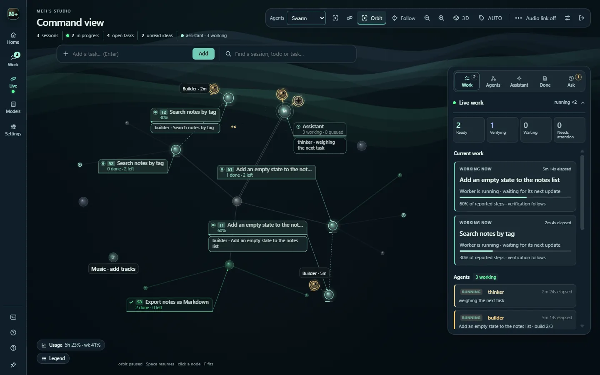
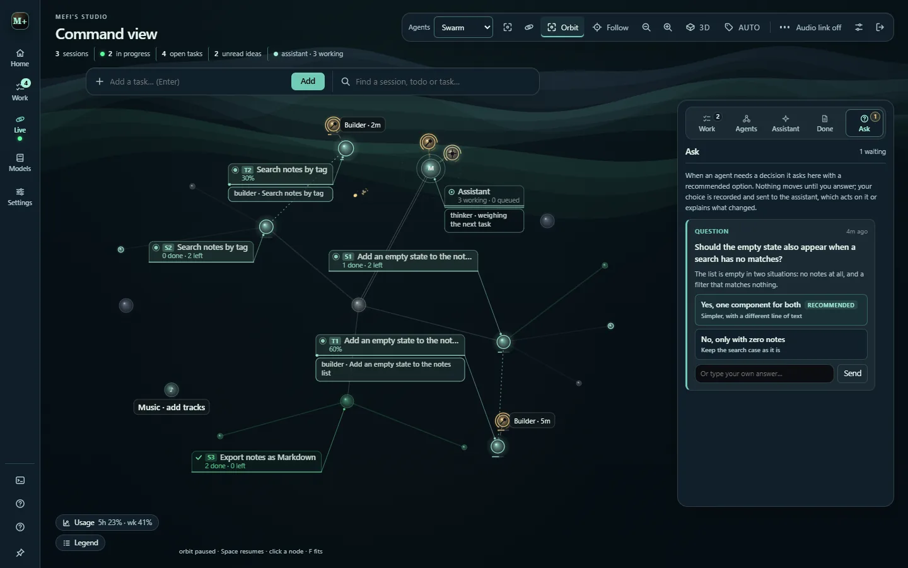

# Command view and the node tree

Press `D`, or choose **Live** in the rail, to open **Command view**: every session, task and agent in the project as a live node tree around the assistant.

## Reading the tree

- The **assistant** sits at the hub; agents orbit it and fly to the node they work on, leaving a coloured wake.
- Each agent wears its role glyph (an eye for the watcher, a hammer for a builder, a crown for the overseer), spins a ring while it works and dashes one while it waits its turn.
- **Speech bubbles** say what each agent is doing. A `→` bubble is a finding going home, a `←` one is it landing, and a diamond packet rides the line between two agents.
- Sessions, tasks, the assistant and working agents carry a **callout**: a numbered plate (S1, T4 and so on) with a status mark, done and left counts, and what the agents think or do there. Plates keep their spot while the tree turns and step aside to a compact label rather than overlap.
- **Lines mean something.** The hub link is doubled, a task's anchor is dotted and marches while its worker runs, an agent's tether is dashed, a finished cluster is stippled, and a done todo's link fades green.
- A finished node **absorbs** into its host, and its brief stays readable on that card under **Absorbed work**.

Animation is not evidence. A moving node means work is scheduled, not that a result is verified; see [Verification and storage](verification.md).

## The right rail

| Tab | Holds |
| --- | --- |
| **Work** | **Live work**: readiness counts (Ready, Verifying, Waiting, Needs attention), current work with reported progress, and the agent roster. |
| **Agents** | Autopilot, Parallel builds, Build mode and Agent mode (**Swarm** or **Cluster**) under an at-a-glance strip. |
| **Assistant** | The always-on thread with the assistant. |
| **Done** | Builds that finished, from the executor ledger; **Clear** wipes the list. |
| **Ask** | Agents' questions, each with a recommended option. Nothing moves until you answer. |

A new question also raises a toast with **Answer** from any view. See [Brain maps and the decision lane](brain-maps.md) for how questions are raised and what each answer does.

## Focus and inspect mode

Clicking a node, or its callout, focuses it: the camera glides in and the rest of the tree keeps turning slowly behind a blur. Selecting a node also hands its detail the whole right rail at full height, and everything else steps back to its edge: the rail tabs become an icon column, the dock folds, and the toolbar goes glyph-only. Every collapsed edge peeks back on hover or keyboard focus.

**Esc** walks out one level per press: the menus return first with the node still open, then the node itself. Below 900 pixels wide the rail hides and a floating card shows the detail instead.

## The toolbar

- **Agents** picks Swarm or Cluster.
- **Orbit** turns the tree; `Space` pauses and resumes it.
- **Follow** frames the active task, and **Fit** (or `F`) repairs the layout.
- Zoom in and out, switch between 2D and **3D**, and choose automatic or manual labels.
- **Audio link** wires bass, mids and treble from the music, desktop audio or microphone to the tree, only when you turn it on.

The **Usage** pill and the **Legend** sit at the bottom-left; the pill opens a compact usage tracker.

## Styles, layouts and skies

Pick a node style and an arrangement per project, in 2D or real 3D:

| Node styles | Arrangements |
| --- | --- |
| Classic orbs, Soft glass, Minimal, Halo, Crystal | Constellation, Branches, Rings, Helix, Terraces |

The sky follows the colour theme (Aurora ribbons, Deep space, Nebula, Rising embers, Fireflies, Soft bokeh, Warm dust), or pick a **Backdrop**, including Quiet grid and Minimal. **Card style** chooses outlined, filled, or filled only when hovered, selected or running. Whether a launch lands on the workspace or straight in Command view is set under **Settings › Studio**.

## Style & sound

**Style & sound** (`U`) recolours Studio and plays your local files or Spotify links through the official embeds. **In source**, it also plays twelve ad-free, listener-funded radio stations, with a second deck that crossfades to a mirror when a stream stalls. The last station is remembered but never starts by itself.
