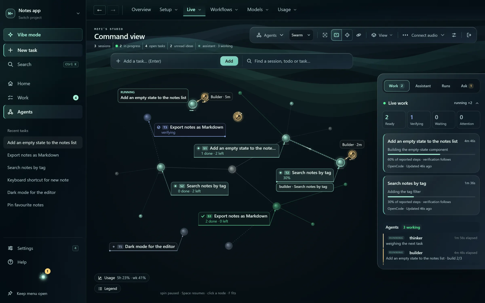

# Command view

Command view shows your project's tasks, sessions and agents as one moving tree. Press `D` or open **Agents › Live › Command**. In Vibe, **Watch** opens it inside Vibe's own rail, and **Back** returns you to Vibe.

Use it to see what's running, follow a task and answer questions without leaving the work.

## Find the work you care about

The toolbar has a box to **Add a task… (Enter)** and a search to **Find a session, todo or task…**. Click a node or its label to open its details on the right.

Agents fly to the work they're doing, and their speech bubbles say what they're up to. Task labels show status and progress. Finished work stays in the task's details, even when the tree folds it into a bigger group.

The tree is an overview. To review what changed and which checks passed, open the task's evidence.

## Use the side panel

| Tab | What to look for |
| --- | --- |
| **Work** | Running work, queued tasks and anything that needs attention. |
| **Assistant** | Your conversation with the assistant, and the **New work** switch. |
| **Runs** | Recent build attempts, grouped by task. |
| **Ask** | Questions waiting for your answer, each with a recommended option. |

Selecting a node adds a **Node** tab with its details. Press `Esc` to step back out. In a narrow window, details appear in a floating card.

**Agents** in the toolbar opens the queue controls: Autopilot, Parallel builds, Build mode, Agent mode, **Stop all** and **Restart Studio**. [Assistant and agents](assistant.md) explains each one.

## Move around

- **Fit** (`F`) rearranges the tree and brings it all into view.
- **Overview** keeps the whole tree framed, and **Follow** tracks the current work. `C` cycles overview, follow and free.
- **Spin** turns the tree. `Space` pauses or resumes the spin. It doesn't pause your agents.
- **View** holds the 3D or flat 2D map (`V`), the node labels (`L`) and zoom.
- The mouse wheel or a two-finger pinch zooms toward the pointer, and the arrow keys and `[` `]` step through the tree.

[Navigation and shortcuts](shortcuts.md#in-command-view) lists every key. If you'd like the tree to hold still, pause the spin and pick a view that's easy to read.

## Ambience

The **Ambience** button sets the mood:

- **Look**: the **Backdrop** behind the tree, **Speech bubbles**, and the **Card style** (Auto, Outline or Filled).
- **Sound**: what the nodes **Listen to** (your local player, desktop audio, or the microphone), and **Zen bells**.
- **Calm**: **Zen mode** fades the panels and tours the tree after 30 seconds without input. You can also park the mouse at the right edge for about two seconds. Move the mouse or press a key to come back.

## Legend and Usage

The **Legend** pill in the corner explains what the colours and rings mean. The **Usage** pill shows readings from your connected providers, with **Refresh** and **Details**, which opens **Agents › Usage**. Refreshing sends no prompts. See [Model Lab and usage](model-lab.md).

## Make it feel like your space

Press `U` to open **Appearance**: **Theme**, **Nodes**, **Layout** and **Interface**. Every theme and node style has been free since 0.4.4, including the Void collection, and you don't need Discord to use any of them. The tree's brightness, outlines and motion live there too. See [Themes, node styles and looks](appearance.md).

The toolbar's audio button (**Connect audio**) opens **Music & video**. Closing that panel keeps playback running. The tree can react to a track, desktop audio or your microphone, and a video can play behind the tree. The microphone only drives the visuals: nothing is transcribed. See [Music, video and the player](media-player.md).

## When Command view opens by itself

In 0.4.4, Studio switches to Command view after five quiet minutes. Move the mouse or press a key, then **Close** (`Esc` or `D`) to go back.

> New in 0.4.5 This becomes a switch in **Settings › General**, **Show Command view after 5 quiet minutes**, and it's off by default. The Command header also says why agents aren't working, with the one control that fixes it. Answered questions leave the **Ask** list at once, and **Stop all** and **Restart** ask twice.

## Other Live views

**Agents › Live** holds more ways to look at the work:

- **Pipelines** (the [Agent brain](agent-brain.md), `J`) draws one task's pipeline: the lead, the steps and the helpers it sent out.
- **Sessions** (`E`) shows each coding session and its saved context. Its **Session tools** open the Assistant, Activity and Diagnostics tabs.
- **Activity** (`3`) opens **Activity & evidence**: pick a session, then read its change feed, diffs, images or log. The file inspector has **Reveal file** and **Copy path**, and you can pin a spot on a PNG. It reads the session records your coding tool keeps; when a tool keeps none, use the task's evidence and attempts instead.
- **Trace** puts Studio's logs in one viewer. See [Trace, logs and diagnostics](trace.md).
- **Overhead** (`O`) shows how tasks relate to sessions.

For reviewing finished work, continue to [Verification](verification.md).
