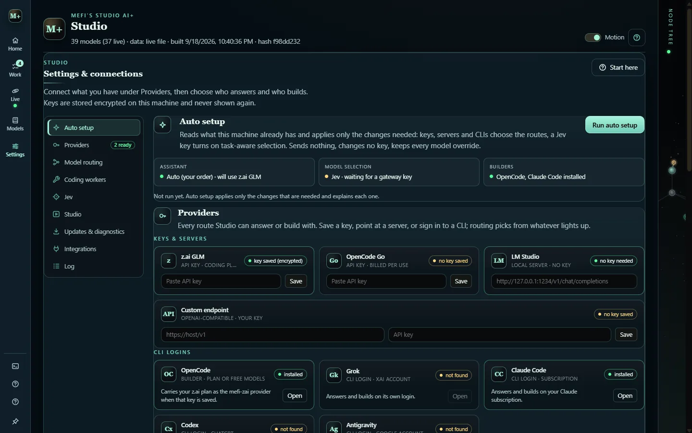

# Connections and providers

Studio never bundles an AI account. You connect what you already have, in **Settings & connections** (`4`), and two capabilities are configured separately:

- the **assistant**: conversation, briefings and planning help;
- the **builder**: the coding CLI that changes files in your project.

A saved key alone never proves a build can start. The readiness line names what the selected option has, and missing one option never blocks the others.



## Pick a route

| What you have | Choose | What it needs |
| --- | --- | --- |
| z.ai coding plan | **z.ai GLM** | a saved z.ai key |
| OpenCode Go subscription | **OpenCode Go** | its saved key |
| Grok, Claude Code, Codex or Antigravity login | that CLI | the CLI on PATH, no key |
| A local model server | **LM Studio (local)** | LM Studio running with a loaded model |
| Another OpenAI-compatible server | **Custom endpoint** | endpoint URL and key |

**AI routing** decides who answers:

- **Auto** walks an ordered provider list you edit in Settings; the first usable provider answers, and the opt-in fallback walks down the list.
- **z.ai only** or **OpenCode Go only** pin a keyed route.
- The Grok, Claude Code, Codex or Antigravity CLIs answer on their own logins.
- **LM Studio** talks to a local server, and **Custom endpoint** uses your own URL and key.

**In source:** three failures in a row from one provider, whether a refused key, an exhausted quota, a transport error, a timeout or a CLI that did not answer, pause that route for 30 seconds. The next route in the auto order answers meanwhile, and the connection log names the paused route and its last error. Saving a key, changing routing or running auto setup lifts every pause.

## Auto setup

**Run auto setup** reads saved-key flags, installed CLIs and, only when nothing else is available, a live local server. It then applies the matching provider, model selection and builder in one pass. It sends no paid request, changes no key, keeps model overrides and reports every choice. A fresh install runs it once by itself on the first launch.

## Builders

Builders run through:

- `opencode run`, the preferred coding worker, with a Studio-managed z.ai provider when that key is saved, or OpenCode's own linked and free models;
- Claude Code, as `claude -p` on your subscription login;
- Codex, as `codex exec` on your ChatGPT login;
- the Grok CLI;
- Antigravity, as `agy` on your Google account.

A failed run gets one automatic fallback, chosen by the kind of failure.

## Coding tiers

A **coding tier** in **Settings › Coding workers** decides what each build may cost:

| Tier | What it runs |
| --- | --- |
| **Auto** | Per-task selection: Jev or the stand-in judge within your provider, otherwise the CLI default. |
| **Free** | A free model, one worker at a time, and never a billed fallback. |
| **Fast** | The quick economical model: GLM 5.3 Flash on the z.ai plan, `sonnet` on Claude Code. |
| **Heavy** | The high-end model: GLM 5.3, or `opus` on Claude Code. |

Tier models are saved per builder CLI, and the Settings line shows what each tier resolves to before anything runs. Free-tier models may use your prompts to improve the model, so keep confidential work on a paid one.

## Models are saved per provider

Models are saved per provider and per builder CLI, so switching routes never carries one provider's model id into another. A provider with nothing saved uses its own default, and the keyed routes keep the role-wide Routine and Heavy overrides.

## Jev model selection

**Jev** is a third-party classifier model that Studio can use to pick a model per task and to classify incoming work. It is optional: without a key for its route, Studio uses fixed model defaults. Each route keeps its own encrypted key.

| Route | Model id |
| --- | --- |
| Vercel AI Gateway | `typesafe-ai/jev` |
| TypeSafe's Jev API directly | `jev-1.13.0` |
| OpenCode Zen, including its free tier | `jev-1.13` |
| OpenRouter | `typesafe/jev-1.13` |

`MEFI_JEV_ROUTE` set to `vercel`, `typesafe`, `zen` or `openrouter` picks the route for headless launches.

## Keys and where they live

Keys are entered once in Settings and encrypted with the OS keystore (`safeStorage`, which is DPAPI on Windows). Only "saved" or "not saved" reaches the interface. They are bound to the Windows account that saved them.

- **In source:** the encrypted keys live in `%APPDATA%\Mefi's Studio AI+\auth.json`, a credentials file kept apart from the `settings.json` preferences.
- **In v0.2.0:** they live inside `settings.json` in the same folder.

A new user or a new machine enters its own keys. Copying the file does not work.

### Headless key setup

Each key can be saved without the interface by pairing a variable with a one-shot flag. The value is copied into the keystore once and never read again, so clear it from your shell afterwards.

```powershell
$env:MEFI_STUDIO_KEY = "..."            ; electron . --set-key             # OpenCode Go
$env:MEFI_STUDIO_ZAI_KEY = "..."        ; electron . --set-zai-key         # z.ai coding plan
$env:MEFI_STUDIO_CUSTOM_KEY = "..."     ; electron . --set-custom-key      # custom endpoint
$env:MEFI_STUDIO_GATEWAY_KEY = "..."    ; electron . --set-gateway-key     # Vercel AI Gateway (Jev)
$env:MEFI_STUDIO_JEV_KEY = "..."        ; electron . --set-jev-key         # TypeSafe Jev API
$env:MEFI_STUDIO_ZEN_KEY = "..."        ; electron . --set-zen-key         # OpenCode Zen (Jev)
$env:MEFI_STUDIO_OPENROUTER_KEY = "..." ; electron . --set-openrouter-key  # OpenRouter (Jev)
```

**In source**, child processes never inherit these variables, so a coding worker cannot read Studio's keys from its environment.

## Account readings

The usage tracker reads each connected provider's own account over its saved key: OpenCode Go's 5-hour, weekly and monthly windows, z.ai's plan quota, OpenRouter's key usage and limit, and the Vercel AI Gateway balance. A provider with no account API says so plainly. Accounts are asked only while the tracker is open, and no prompts are sent. See [Models, Model Lab and usage](model-lab.md).

## Private release updates

The public repository needs no token. A private one needs a read-only token: save it in **App updates**, set `MEFI_STUDIO_GITHUB_TOKEN`, or let Studio reuse `gh auth token`.
