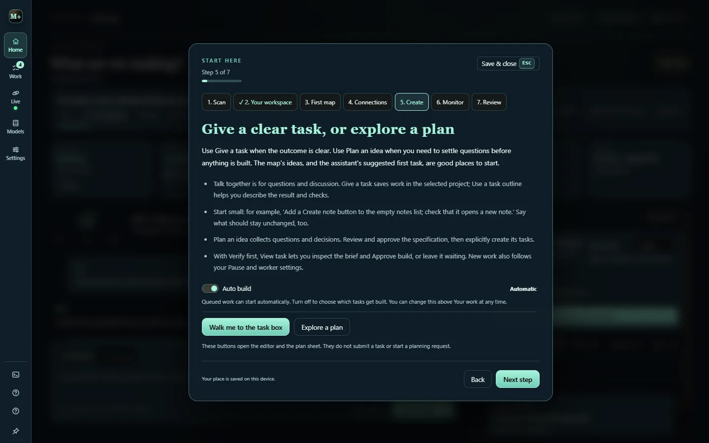
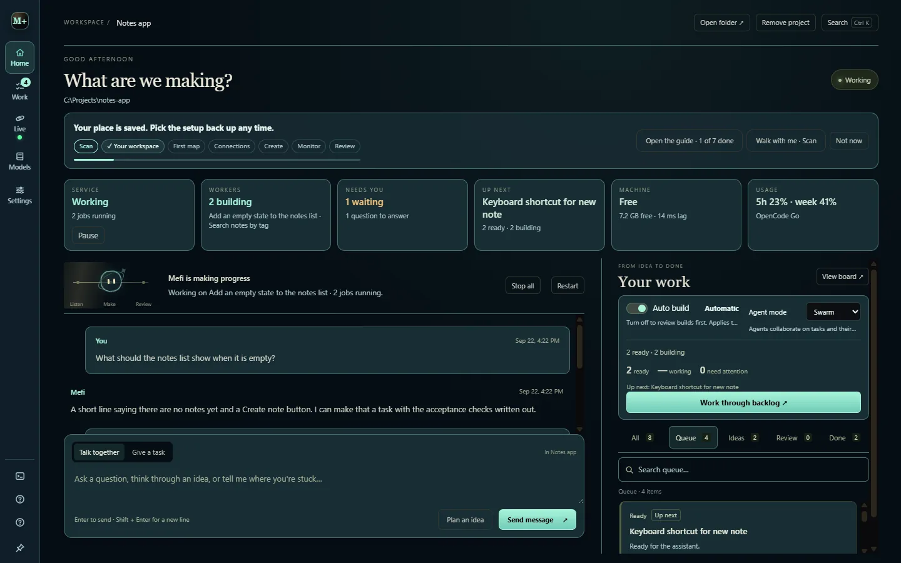

# Your first project

Studio opens with no project at all: nothing is read, built or spent until you choose a folder and start the agents. This page follows the repository's [GETTING_STARTED.md](https://github.com/nateecho32-stack/mefi-studio/blob/main/GETTING_STARTED.md).

## The Start here walkthrough

The walkthrough opens by itself on your first launch. It has seven stops: **Scan**, **Your workspace**, **First map**, **Connections**, **Create**, **Monitor** and **Review**. Close it whenever you like; it remembers your place per device. Open it again from **Start here** at the foot of the left rail, or from Help.



Each stop has a **Walk with me** button, or a specific one such as **Walk me to the task box**. It keeps a small coach in the corner while it opens the matching menu and highlights the exact control. Press **Done — next stop** and the coach moves on; **Esc** or **End tour** puts it away. Reading the guide never creates or starts work.

The **Scan** stop reads what this computer already has: the OpenCode command line, the providers linked in it, the free models it can reach and the keys saved in Studio. It never opens OpenCode's credential store, never sends a prompt and never changes OpenCode's own configuration.

## Every launch: choose the project, then start the agents

Studio opens on a launch screen before it reads anything. Pick the project (the last one is preselected) or **Open another folder…**, then choose:

- **Open studio** keeps the assistant and the coding workers off. The companion bar reads *Agents are waiting for you*; **Start agents** there or in the tray menu releases them.
- **Open and start agents** starts everything at once.

One launch skips the question. If Studio went away while work was going, after a crash, a reboot or its own update restart, and that work was under ten minutes old, the next launch reopens the same folder and says *Picking up where you left off*. Agents that were running come back; agents that were held stay held. Closing Studio yourself, with Alt+F4, the close button or **Quit** in the tray, ends the sitting, so the next launch asks again.

## 1. Choose the folder you want to work on

Open **Projects** with **M+** at the top of the left rail and choose **+**, or choose **Open a folder**. The first folder becomes the active project, and Studio scans it locally, with no AI request, showing old plans and starting points in **Analyzer**. Later folders are added alongside; select one to switch. **Remove project** drops a folder from the list without touching its files.

For a first run, pick a small project whose changes you can inspect easily. In v0.2.0 the project panel opens from the left edge of the window instead of **M+**.

## 2. Connect your tools

A fresh install runs **auto setup** once by itself on its first launch, from the keys, CLIs and local servers already on the machine, and **Settings & connections** says what it chose. Open it to review that choice, press **Run auto setup** again after adding a key or CLI, or pick a route yourself. [Connections and providers](connections.md) has the route table.

Conversation and coding are separate capabilities: a saved assistant key alone never proves a builder can start. Read the readiness line before starting a task. The catalog, manual planning and saved work all work with no connection at all.

## 3. Give one clear task

Choose **Give a task**, describe the change and what would count as done, then **Create task**. **Use a task outline** adds room for the goal, acceptance checks and boundaries:

```text
Add a clear empty state to the saved notes list.

Done when:
- With no saved notes, show a short explanation and a Create note button.
- Creating a note replaces the empty state with the normal list.
- The layout works in the smallest supported window.

Keep unchanged:
The existing note format and save location.
```

- Chat and task drafts are saved separately for each project. **View task** opens the saved brief and status.
- A failed board refresh does not mean creation failed. Use **Retry loading** before adding the same work again.
- **Auto build** is on by default. Turn it off for **Verify first**, and each task waits in **Review** until you choose **Approve build**. Editing the scope or retrying needs approval again.
- Use **Talk together** for discussion, and [Plan an idea](planning.md) when the approach is unclear.

## 4. Follow the work

The **Studio at a glance** strip at the top of the workspace shows the service, running workers, what needs you, what is next, the machine and today's usage. Its **Pause** holds all new work until **Resume**.



**Your work** has **All**, **Queue**, **Ideas**, **Review** and **Done**. **Live** in the rail opens Command view, where **Live work** shows running workers and their reported steps, and the **Agents** tab holds Autopilot, Parallel builds, Build mode and Agent mode.

| What you see | What it means | Next step |
| --- | --- | --- |
| Ready | Eligible for scheduling | Check Pause, the coding connection and any dispatcher hold |
| Awaiting build approval | Verify first is holding unapproved work | Review the task and choose Approve build, or leave it waiting |
| Working | A worker has started | Follow its activity and inspect the result when it finishes |
| Waiting on prerequisites | Required tasks are unfinished | Open the named prerequisite |
| Retry scheduled | A failed attempt is cooling down | Inspect the failure and the displayed retry time |
| Needs attention | A blocker or retry limit needs a decision | Open the task and correct the cause before retrying |
| Awaiting verification | The attempt finished but completion is not established | Review checks, evidence and delegated work |
| Done | Verified or explicitly confirmed complete | Read the result and inspect the actual change |

## 5. Review and recover

Open **Review** for unfinished verification and blocked tasks. A worker's exit alone does not prove the change works: read the evidence, run the project's own checks and try the changed workflow before accepting it.

**Pause** stops new scheduling while current jobs finish; it does not cancel them. A worker that cannot be confirmed stopped keeps its file ownership so no other attempt writes over it. Follow the reported recovery steps, and never delete task records or ownership files to force a run. More in [Troubleshooting](troubleshooting.md).

## Review the defaults

These ship on and are worth a look on a new machine. All stay editable.

- **Auto build** is on. Turn it off for **Verify first** when each task should wait for approval.
- **Parallel builds** follows **Machine managed** admission; manual limits of one to three workers suit a machine dedicated to Studio.
- **Proactive** briefings, **useWeb**, **auto reference** and the machine guards (auto-kill strays, 240 idle seconds, 20-minute age, 1.5 GB) are on. Relax the guards on a small or busy machine rather than switching them off.
- **Your name**, the **companion name**, the theme and the motion preference live under **Make yourself at home** in the project panel and stay per machine.
