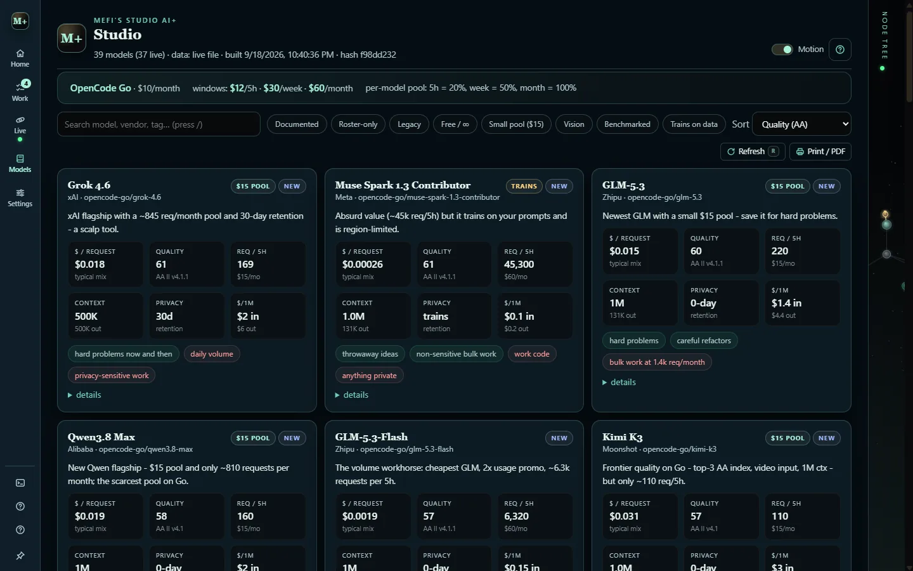

# Models, Model Lab and usage

Studio keeps a catalog of models, measures the ones you use, and adds up what they cost. Opening any of these views never runs a paid measurement.

## Model catalog (1)

The **Model catalog** is the part of the app that kept the old name "booklet". Each model gets a card with cost per typical request, a quality index, requests per window, context size, privacy retention and fit tags such as "hard problems" or "anything private".

- Filter by documented, free, vision, benchmarked or "trains on data", sort by quality or cost, and press `/` to search.
- `R` refreshes the catalog; **Print / PDF** makes a printable booklet.
- From a source checkout, `npm run data` refreshes the model data and `npm run data:offline` rebuilds it without network.
- Only the two public catalogs, `data/curated.json` and `data/models.json`, are in the repository.

Prices, pools and quotas are catalog data, not verified pricing. Check your provider before relying on a number, and read the privacy tags before routing private code to a model that trains on prompts.

## Model Lab (2)

**Model Lab** records, per project:

- observed latency, delivered tokens per second and error rates;
- usage and USD cost as the provider reported them;
- human ratings and model ratings, kept separate;
- task-type filters and effort breakdowns, including the effort requested versus the effort the provider confirmed.

Unknown values stay unknown and are left out of every score, and a successful call is not a verified task result. **Context** previews the current task brief within a chosen token budget and reports what was included, shortened and left out, without changing the saved originals.

A **speed probe** sends one small request to a chosen model and puts the result in the log. It is the only measurement that costs anything, and only when you press it.

## Usage tracker

The usage tracker adds up two ledgers per day, provider and model:

1. the calls Studio made itself: assistant HTTP and CLI routes, Jev and speed probes;
2. every coding-session turn OpenCode's own store recorded for the project, whichever route the builders used.

Each connected provider also gets its own account reading over its saved key: OpenCode Go's 5-hour, weekly and monthly windows, z.ai's plan quota, OpenRouter's key usage and limit, and the Vercel AI Gateway balance. A provider with no account API, such as Zen, TypeSafe, the CLIs or a local server, says so plainly.

- Live readings and the local estimate stay separate.
- A plan or subscription reports no per-call cost, so those calls show as **unpriced**, never as free.
- The CLI assistant routes run in their JSON output mode so their token counts reach the ledger. Builder runs on the Grok, Claude and Antigravity CLIs report no tokens.
- The **Usage** tile on the workspace, the **Usage** pill in Command view and the Model Lab **Tracker** tab all read the same report. Accounts are asked when a view opens and every five minutes while it is visible. No prompts are sent.

## Routing and model choice

**AI routing** picks who answers, **Model selection** picks the model (Jev or fixed defaults), and the **coding tier** caps what a build may cost. All three are saved per provider or per builder CLI so switching never mixes them. The route table, Jev routes and tiers are on [Connections and providers](connections.md).

Model Lab measures and rates; it does not change your route. Heavy calls request low effort first, and an auth, quota or transport failure never raises reasoning effort.

## Jev intake

The **Jev intake classifier** runs in shadow mode when work is admitted and records `jev-proposal` events. It is advisory: it can never suppress work, merge tasks or start agents. Its kill switch is `settings.jevShadow === false`.
