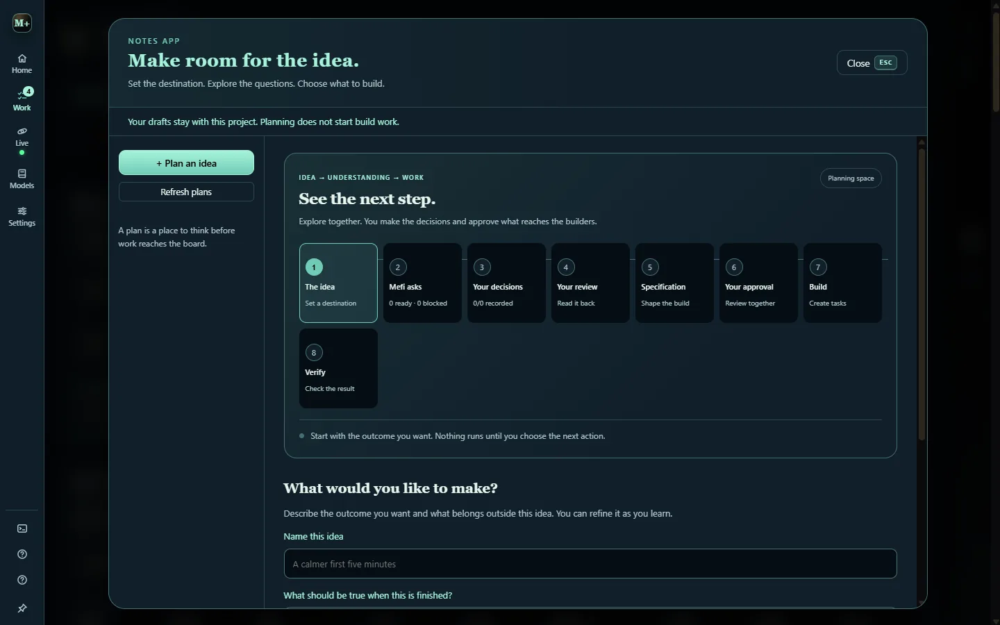

# Plan an idea

**Plan an idea** opens **Plans** (`P`) for work whose route is unclear or that has several dependent steps. A plan turns an idea into decisions, the decisions into a specification, and the specification into tasks, with your explicit approval between each step. Planning itself never starts a build.

## The eight steps

| Step | What happens |
| --- | --- |
| **The idea** | Name the outcome in your own words, what should be true when it is finished, and what is out of scope. |
| **Mefi asks** | The interview: Mefi asks the one question that would most change what gets built. |
| **Your decisions** | You record the decisions. Only a decision you record becomes a requirement. |
| **Your review** | **What we understand** reads the whole plan back and waits for your confirmation. |
| **Specification** | Small tasks with acceptance checks and prerequisites, written by you or requested from the assistant. |
| **Your approval** | You approve the specification draft. |
| **Build** | You explicitly create its tasks on the board. |
| **Verify** | The tasks run and settle like any other; see [Verification and storage](verification.md). |

## The interview

Mefi asks one question at a time and waits for your answer. It reads your answer back as an unconfirmed interpretation, raises a conflict when a new answer contradicts an earlier one, and follows what you actually said into the next question.

- Every line is labelled by origin: your answer, Mefi's reading, its recommendation or its question.
- A reading can only be copied into your decision box, for you to edit and record.
- You can still ask for a batch of questions, ask Mefi to explain the tradeoffs on one, or write the whole plan by hand.

## What we understand

Once every unknown is settled and every question decided, **What we understand** reads the plan back and waits for your confirmation. Nothing is drafted or approved before you give it. Changing the destination, an unknown or any decision withdraws the confirmation, so a specification never rests on a plan that has since changed.

## What planning cannot do

- Assistant suggestions and interview lines never resolve a question, confirm the understanding or approve work. Only you do.
- Planning cannot launch coding workers. Tasks it creates behave like any other task, including **Verify first** if it is on.
- A plan with unsaved edits is not converted to tasks until the edits are saved.

## Without an AI key

The manual controls work without any connection: collect unknowns, record decisions, write the specification yourself, approve it and create the tasks. The interview and a requested specification need a connected assistant route.

## Where plans live

Plans and their revision history stay in the project's local `planning.json`, which Git ignores. They are never committed or packaged. See [Privacy and security](privacy.md).
