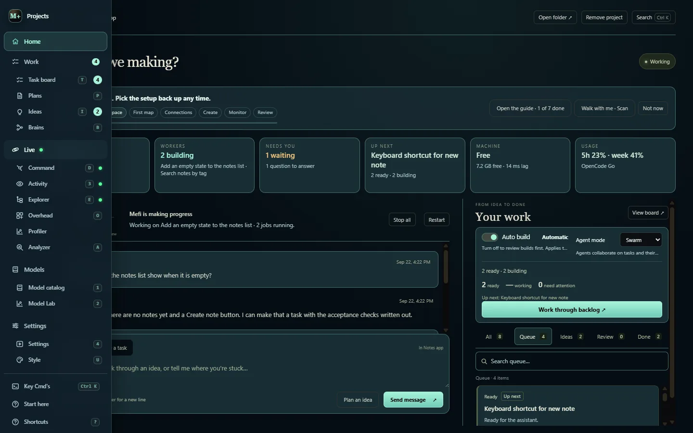

# Getting around and shortcuts

Every destination in Studio has a place in the navigation, an entry in the `Ctrl K` palette and, for most, a single key. All three are built from one registry, so a destination cannot appear in one and be missing from another. Press `?` inside Studio for the full sheet.

## The rail (in source)

One rail down the left edge is the whole app's navigation:

| Section | Destinations |
| --- | --- |
| **Home** | the workspace |
| **Work** | Task board, Plans, Ideas, Brain maps |
| **Live** | Command view, Activity, Explorer, Overhead, Profiler, Analyzer |
| **Models** | Model catalog, Model Lab |
| **Settings** | Settings & connections, Style & sound |

At rest the rail shows five icons with their names. Hover it or Tab into it and it opens over the page, listing every destination with its key, without moving anything underneath. **Keep open** pins it and the page makes room. **M+** at the top opens the project panel; **Key commands**, **Start here** and **Shortcuts** sit at the foot.

**Switch navigation: rail or classic** in `Ctrl K` brings the older menus back for anyone who prefers them.

**In v0.2.0** the same destinations live in the tabs row, the Command view dock and the hover sidebar, and the project panel opens from the left edge of the window.

## Single keys

Single keys work whenever no text field has focus.

| Key | Opens |
| --- | --- |
| `H` | Your workspace |
| `D` | Command view |
| `T` | Task board |
| `P` | Plans |
| `I` | Feature ideas |
| `B` | Brain maps |
| `E` | Session explorer |
| `O` | Overhead |
| `A` | Analyzer |
| `1` | Model catalog |
| `2` | Model Lab |
| `3` | Activity & evidence |
| `4` | Settings & connections |
| `U` | Style & sound |

| Key | Does |
| --- | --- |
| `Ctrl K` | Key commands: find any tool, task or setting by name |
| `/` | Search the model catalog |
| `R` | Refresh the model catalog |
| `G` | Pin the node tree |
| `?` | The shortcut sheet |
| `Esc` | Close the top-most layer, one level at a time |

## In Command view

| Key | Does |
| --- | --- |
| `Space` | Pause or resume the orbit |
| `F` | Fit the tree to the view |
| `Esc` | Step out of inspect mode: first the menus return, then the node closes |

Clicking a node focuses it; clicking empty canvas lets go. See [Command view and the node tree](command-center.md).

## In Brain maps (in source)

| Key | Does |
| --- | --- |
| `F` | Fit the whole map |
| `Space` | Open the parts search where the canvas is looking |
| `Ctrl F` | Find a part already on the map |
| `Ctrl A` | Select every part |
| `Ctrl D` | Copy the selected parts with the wires between them |
| `Delete` | Remove the selected parts |
| Arrow keys | Nudge the selected parts |
| `Ctrl Z` / `Ctrl Shift Z` | Undo / redo any edit |
| `F8` | Walk the problems part by part |
| `[` / `]` | Hide or show the parts rail / the inspector |
| `?` | Legend and every shortcut |
| `Esc` | Cancel a wire or gesture, then clear the selection, then close |

## In the walkthrough

**Walk with me** opens the matching menu with a coach in the corner. **Done — next stop** moves on; **Esc** or **End tour** ends it. Your place is remembered.

## On this site

Press `/` on any wiki page to jump to the search box.
