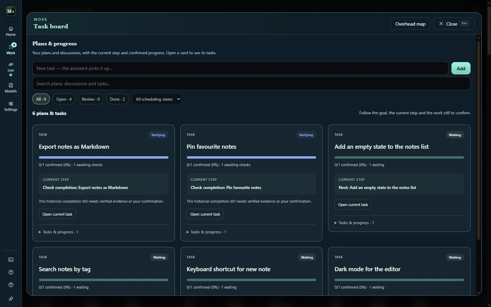

# Tasks and the board

Work in Studio is a task on a project's board. Each task carries its brief, acceptance checks, prerequisites, handoff context, attempts, evidence and history. The board is the record; [Verification and storage](verification.md) explains where it lives.

## Three ways to start

- **Give a task** creates real work. Describe the change and what counts as done; **Use a task outline** adds room for the goal, checks and boundaries. Drafts are saved per project.
- **Talk together** is discussion. Asking for work queues it; vague chatter gets a yes-or-no offer instead of an accidental job.
- **Plan an idea** is for work whose route is unclear. See [Plan an idea](planning.md).

## Auto build and Verify first

**Auto build** is on by default: a created task is eligible for scheduling straight away. Turn it off for **Verify first**, and each task waits in **Review** until you choose **Approve build**.

- Approval covers the saved task scope. Editing the scope or explicitly retrying needs approval again.
- The choice is saved across restarts for all projects.
- Approval never overrides **Pause** or unfinished prerequisites.

## Studio at a glance and Your work

The strip at the top of the workspace shows the service with a single **Pause / Resume**, running workers, what needs you, what is next, the machine gauge and today's usage. Each tile opens the view that owns it. **Pause** holds every kind of new work, the same hold as Command view's **New work** switch, while current workers finish.

**Your work** separates **All**, **Queue**, **Ideas**, **Review** and **Done**; archived completions stay visible.

## Task states

| State | Meaning | Next step |
| --- | --- | --- |
| Ready | Eligible for scheduling | Check Pause, the coding connection and any dispatcher hold |
| Awaiting build approval | Verify first is holding unapproved work | Review the task and choose Approve build, or leave it waiting |
| Working | A worker has started | Follow its activity and inspect the result when it finishes |
| Waiting on prerequisites | Required tasks are unfinished | Open the named prerequisite |
| Retry scheduled | A failed attempt is cooling down | Inspect the failure and the displayed retry time |
| Needs attention | A blocker or retry limit needs a decision | Open the task and correct the cause before retrying |
| Awaiting verification | The attempt finished but completion is not established | Review checks, evidence and delegated work |
| Done | Verified or explicitly confirmed complete | Read the result and inspect the actual change |

## The task board

The **Task board** (`T`) opens as plan cards with progress, a current step and what is still to confirm. Each card holds prerequisites, handoff context and task history. Missing prerequisites and dependency cycles are surfaced for correction rather than silently ignored.

## Queue controls

- **Work through backlog** works the project's existing tasks and ideas first, admitting saved ideas in small batches and keeping a small runnable buffer.
- **Parallel builds** defaults to **Machine managed**: admission follows measured app responsiveness, with optional manual limits of one to three workers. High CPU alone never limits builds.
- **Agent mode** chooses how the roster shares work: **Swarm** spreads it across the queue, **Cluster** keeps workers on one goal at a time.
- **Autopilot** lets the assistant start work on its own; **New work** is the master switch that holds every kind of new start.
- **Work on it** on any node makes it the assistant's next piece of work, pinned to the front of the board.

The Free coding tier runs one worker at a time whatever the parallel setting says.

## Keeping workers apart

Studio holds a normalized-path write lock per file: one writer per path, and a second dispatch on the same file is refused or deferred until the first releases. Separators and case are normalized, so two spellings of one path are one claim. Live-editor observations block known conflicts too.

These are cooperative locks, not a sandbox: unrelated tools can still edit the same files. For stronger isolation, opt-in per-session worktrees give each run its own checkout. See [The assistant and the agent loop](assistant.md#per-session-worktrees).

## Handoffs and retries

- **Handoffs are durable.** A child task keeps its exact identity and full scope, becomes a card of its own, and holds its parent until it finishes. An exhausted child holds its parent for review while independent work continues.
- **Chains have a depth limit.** In source, a run at the limit that still asks to hand off has that request declined and named on the card's log, so the chain finishes instead of stalling.
- **A task gets five tries.** A worker that never starts does not spend one: start failures have their own budget and requeue on a cooldown of 1, 2, 4 and up to 30 minutes. In source, the start budget also learns from runs that do start, so a slow but working CLI is not killed forever.

## Review and recover

Open **Review** for unfinished verification and blocked tasks. A worker's exit alone does not prove the change works. Read the evidence, run the project's checks and try the changed workflow before accepting.

If work stops progressing, read its last activity and the scheduling reason before retrying. A worker that cannot be confirmed stopped keeps its file ownership, so another attempt cannot write over it. Follow the reported recovery steps; never delete task records or ownership files to force a run.
